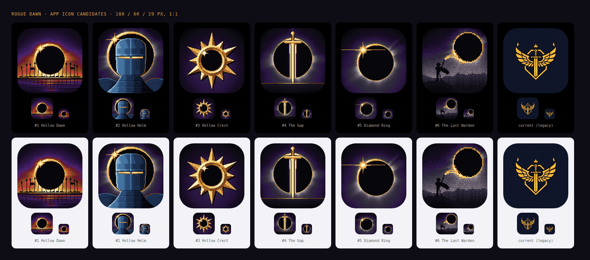

# App icon: Rogue Dawn

This replaces the gold winged sword over a shield. That icon was generic, and it sat close
to the heraldry of the series we're compared with. The new icon draws from the Ink & Ember
art bible: the Hollow Sun (a black disc with a thin gold corona), dawn breaking against it,
gold reserved for the player's light, and the empire in iron and crimson.

**Shipped:** #1 Hollow Dawn (`hollow-dawn.png`).



| Sheet | What it shows |
|---|---|
| [`comparison-sheet.png`](comparison-sheet.png) | Every candidate at 1024, then 180, 60 and 29 px, each downscaled from the master and shown 1:1, on a dark and a light ground, with the iOS corner mask |
| [`homescreen-mock.png`](homescreen-mock.png) | Each candidate in a home-screen row next to generic app tiles, on a dark and a light wallpaper, at iPhone 3x scale |
| [`overview.png`](overview.png) | All six plus the legacy icon at 180, 60 and 29 px |

## Ranking

| # | Candidate | Concept | Verdict |
|---|---|---|---|
| 1 | **Hollow Dawn** `hollow-dawn.png` | The Hollow Sun rising over a horizon hedge of the empire's pikes, with two black-and-crimson standards. The corona breaks into a dawn band of crimson, ember and gold. A flooded plain holds the glow in streaks. | **Pick.** This is the only candidate that says *dawn* and *eclipse* in a single image, which fits a game called Rogue Dawn. The pike line gives the tactical, army-against-you tone, and the thin gold horizon is the lone thread of light. At 29 px it becomes a black disc in a burning band: one shape, very high contrast, and unlike anything else on a home screen. The warm band keeps it clear of both dark and light wallpapers. |
| 2 | **Hollow Helm** `hollow-helm.png` | An empty great helm in blued steel (the player's colour), haloed by the Hollow Sun. The only light is dawn through its visor slit. | The strongest genre signal (knight = tactics RPG) and the most character. It reads clearly at 29 px as a gold ring with a slit. It ranks below Hollow Dawn because a helm is a common RPG icon and says less about *this* game's sun. It's the best alternative if you want a face. |
| 3 | **Hollow Crest** `hollow-crest.png` | The sun as negative space: a faceted gilt sunburst whose centre is a hole, lit from the upper-left, with the diamond-ring glint on the rim. | The boldest and most graphic mark, and the best at 29 px. It would make a good logo or favicon. At a glance it can pass for a generic sun or weather glyph, and it carries the least mood. |
| 4 | **The Gap** `the-gap.png` | The eclipse splits down the middle and a sword of light stands in the seam. | Clean and legible, but a sword in a circle is the most familiar fantasy mark here. It's also the closest to the old gold-sword language we are moving away from. |
| 5 | **Diamond Ring** `diamond-ring.png` | The instant the light returns: one white-gold bead flares on the black sun's rim, and its ray becomes a single thread. | Elegant and minimal, and the most faithful to the title key art's sun. It's also the darkest and lowest in contrast, and eclipse imagery on its own is stock-photo familiar. |
| 6 | **The Last Warden** `last-warden.png` | The title's lone figure on the promontory, drawn in its own pixels (64 grid, chunkier), with gold threads spun from the Hollow Sun to a raised hand. | The closest link to the lore and the title screen. Below 60 px the figure disappears and only the eclipse is left, so it works better as a store screenshot or loading card than as an icon. |

None of the candidates has text, transparency, wings, a shield crest, skulls or runes. All are full-bleed opaque 1024 × 1024 PNGs.

## Swapping to another candidate (one command)

```sh
npm run gen:icons -- --from docs/art-direction/app-icon/hollow-helm.png
```

This copies the candidate over `tools/icon-src/app-icon-pixel.png` as opaque RGB, then
regenerates everything else from it:

- `public/icons/`: `apple-touch-icon-180.png`, `icon-192.png`, `icon-512.png`,
  `icon-512-maskable.png`
- `ios/App/App/Assets.xcassets/AppIcon.appiconset/AppIcon-512@2x.png`: the single-size
  1024 universal icon (`Contents.json` is unchanged)

File names don't change, so nothing else needs editing. The old icon is kept at
`tools/icon-src/app-icon-winged-sword-legacy.png`. You can restore it the same way with
`--from tools/icon-src/app-icon-winged-sword-legacy.png`.

The maskable icon is now the same full-bleed art. It used to be padded to 80%, which
showed up as a frame under squircle launcher masks. Every candidate keeps its focal shape
inside Android's centre-80% safe circle. The Gap's pommel and Hollow Crest's ray tips reach
past it, so a circular launcher trims them. If you add a new candidate, keep its focal shape
inside that circle.

## Rebuilding the candidates and sheets

```sh
node tools/art/app-icon/build.mjs             # candidates + all three sheets
node tools/art/app-icon/build.mjs --no-sheet  # candidates only
node tools/art/app-icon/sheet.mjs             # sheets only (Playwright, local chromium)
node tools/art/app-icon/splash.mjs            # the iOS launch image
```

Everything is procedural and deterministic (`tools/art/app-icon/concepts.mjs`, no
`Math.random`, no generated images, no API calls). The art uses the title key art's own
method. Each icon is a 128 × 128 plate (Last Warden: 64 × 64) painted only from the
`PALETTE` ramps exported by `src/art/keyart/hollowSun.js`, with Bayer 4×4 ordered dither,
and scaled up nearest-neighbour to 1024. At 1024 one art pixel is an 8 × 8 block, which
gives the SNES / PC-98 look up close. At home-screen size (180 px) that's about 1.4 device
pixels per art pixel, so the dither averages out into smooth gradients. The key light is
low and warm from the upper-left, as in the art bible. The masters have fewer than 256
colours and are stored as indexed PNGs, which is lossless here: `build.mjs` checks every
pixel and falls back to RGB otherwise. They're 6–9 KB each.

## Launch image

`ios/App/App/Assets.xcassets/Splash.imageset/` still held Capacitor's placeholder, a blue X
on white. It now holds the Hollow Dawn mark with no text: the Hollow Sun with its
crimson-to-ember corona and the gold horizon thread, centred on the palette void
(`#07060b`). All three files Contents.json lists (1x/2x/3x, 2732 × 2732) are the same
6 KB image, and the file names are unchanged. `LaunchScreen.storyboard` now uses the void
as its background colour instead of the system white, so there's no white flash. The
storyboard aspect-fills the square. A landscape phone shows only the centre ~1260 rows
and a portrait phone only the centre ~1260 columns, and the whole mark (560 px) fits in
both. Rebuild it with `node tools/art/app-icon/splash.mjs`.

## What you still need to do

- **iOS build:** run `npm run ios:sync` (build + `cap sync ios`), then `npm run ios:open` and archive in Xcode. The asset catalog is
  compiled into the app, so the new icon and launch image arrive with the next build.
  Launch images are cached aggressively. On a test device, delete the app (and restart
  the device if it's stubborn) before judging the new splash.
- **App Store Connect:** there's nothing to upload separately. The store icon is the 1024
  taken from the build's asset catalog. It's opaque RGB with no alpha channel, as App
  Store validation requires.
- **Web / PWA:** the icons are precached by the service worker. Installed home-screen
  PWAs pick up the new icon when the OS refreshes the manifest, which on iOS usually means
  removing and re-adding the web app.
- **Names:** the display name ("Rogue Dawn") belongs to the rename branch. This branch
  changes no names or strings. `manifest.webmanifest` `background_color` / `theme_color`
  (`#0a0c1e`) already match the art's night ink and need no change.
