# PC-98 portrait pass — build

The owner-approved PC-98 direction (board prototype: `../../board/pc98/`) applied to every
portrait the player sees. One Node + sharp tool renders all 94 portrait ids; the runtime
resolves every portrait site to those renders.

- **Tool:** `tools/art/pc98/` — `node tools/art/pc98/build.mjs` (deterministic; a second run
  changes no file), review sheets `node tools/art/pc98/sheet.mjs`, in-game captures
  `node tools/art/pc98/capture.mjs` (dev server).
- **Outputs:** `assets/portraits/pc98/` (synced to `public/assets/portraits/pc98/`), runtime
  index `src/ui/Pc98PortraitManifest.json`, provenance `assets/portraits/pc98/manifest.json`
  (source file + hash, native grid, framing, faction, per-size palette).
- **Runtime:** `src/ui/portraitArt.js` (ids, sizes, URLs, plates, canvas atlas frames),
  `src/ui/portraits.css`.
- **Escape hatch (dev builds only):** `?portraitArt=classic` loads the original files and the
  old DOM paths.

## The look

| Rule | How |
| --- | --- |
| 12-bit colour | every colour snapped to 4 bits/channel, chosen in OKLab among the 8 corners of its cell; gaining chroma costs extra so pale skin never snaps yellow |
| ~16 colours incl. ink | 13 figure colours + ink at 192 and 96px (+2 plate tones); 11/10/10/9 (+ink) at 64/48/40/32, always a subset of the master palette |
| Perceptual palette | weighted k-means in OKLab, merged (Ward) *within colour families* only — a small teal scarf, steel pauldron or iris is never averaged into skin; face and saturated pixels weigh more; iris/gem accents recovered from the face and never dropped at smaller sizes |
| Ordered dither, near colours only | Bayer 4×4 between the two nearest palette colours, only when they are close in OKLab and of compatible hue; mix quantized to PC-98 pattern levels (solid, 25% dots, 50% checker); a mode filter keeps levels coherent so gradients band cleanly; patterns stay in global phase |
| Material aware | skin: sparse (50% checker only in the transition band); cloth/metal/hair: 25/50/75%; ≤64px: checker only, none on skin; 32px: no dither |
| Selective ink | 1px silhouette, the reference's own dark line work unified to one ink, luminance edges inked on the darker side only; lines through light materials take a dark shade of the local hue; iris colours protected; lone ink specks removed outside the face |
| Faction plate | two 12-bit tones from the art-bible ramps dithered top→bottom (0/25/50/75/100%): lords **ember-ink**, player units **steel**, enemies and bosses **blood**, NPC allies **verdigris**, corrupted (Entity, revenant, zombie) **unlight**. The plate is a separate image drawn under the transparent figure (CSS background), so one figure serves every side: a recruited boss stands on steel, an NPC on verdigris |
| De-pixelize | the rebuilt 1254px references are renders of an ~88–137px pixel grid (measured per portrait); a blur proportional to the upscale ratio before quantization turns their staircases into smooth cel contours at the target grid |
| Legacy backdrops | painted/flat backdrops removed by region growing from the frame in CIELAB with tolerances adapted to the backdrop's flatness; the old `#1a1a2e` enemy composites (holes punched through dark armour) get their silhouettes closed; crops and tolerances per portrait in `tools/art/pc98/portraits.config.json` |

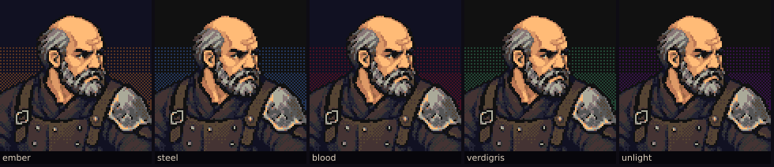

## Sizes (measured display sizes, CSS px)

Every size is rendered **from the source**, never downscaled from the dithered master
(that would moiré), and shown at 1:1 CSS pixels (or an integer multiple) with
`image-rendering: pixelated`, so on a DPR-3 iPhone each portrait pixel is exactly 3×3
device pixels.

| Size | Where | CSS box |
| --- | --- | --- |
| 192 | boss encounter bust | 190 → `192 × --ce-bust-px` (integer; capped at 36% of the frame) |
| 192 @2x | crit / weapon-art cut-in eyes strip | background 386.7 → `384 × --ce-px` |
| 96 | dialogue bust (DOM) | 88×104 → 96×96 |
| 64 | home base identity; roster summary on large desktops (`<picture>`); canvas dialogue fallback, canvas cut-in fallback (atlas) | 72 → 64 |
| 48 | battle forecast (DOM `.mb-portrait`), Sera's rewind offer (`48 × --ce-px`), home base lord rows; canvas unit detail/roster (atlas) | 52/56 → 48 |
| 40 | roster summary on phones; canvas forecast and home base (atlas) | 40×46 |
| 32 | roster list faces, party rows, Loom party chips; canvas home base cards (atlas) | 30×38 / 30 → 32 |

Thumbnails (≤64) crop toward the face using the eye-line framing
(`src/ui/ceremonyPortraitFraming.json`, now authored for all 94 ids); the eye strip uses the
same framing.

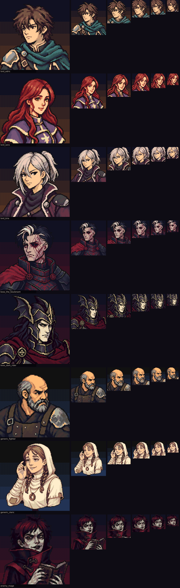

Weight: 94 portraits × 6 sizes + baked 192 textures + 4 canvas atlases + 30 plates ≈ 2.9 MB
(palette PNGs, 4-bit where ≤16 colours). The boot no longer downloads the 34 MB of
1254px rebuilt sources; phones defer the legacy group and atlases as before.

## Contact sheets

- `contact-rebuilt.webp` — the 29 rebuilt references, before (left) / after (right).
- `contact-legacy.webp` — the 65 legacy-only portraits, before / after.
- `contact-all.webp` — all 94 through the pass on their plates.

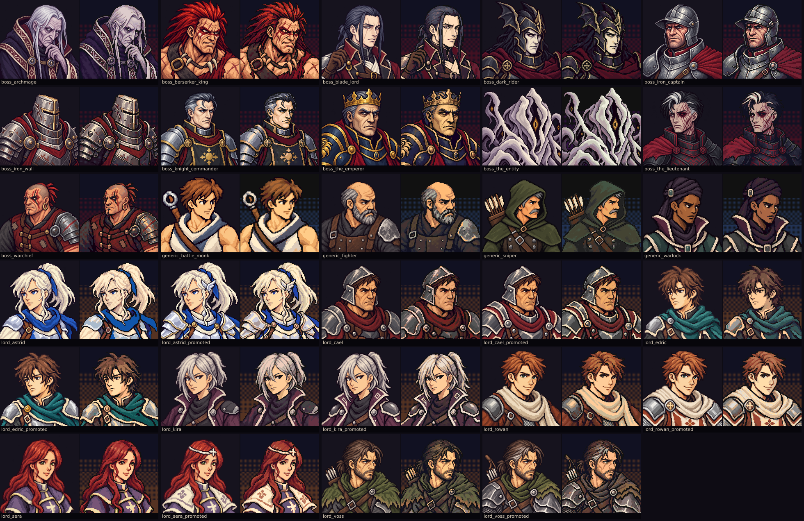

## In-game captures

`<scene>-<W>x<H>[m]@<dpr>x-<art>.webp`, `art` = `classic` (before) or `pc98` (after); `m` =
iPhone emulation (touch, mobile preview). Scenes: `dialogue-1/2` (run start, Sera and
Edric), `boss-card`, `cutin-crit` (Edric), `cutin-boss` (Dark Rider), `cutin-generic`
(legacy-sourced enemy), `forecast`, `fallen-offer` (Sera's rewind offer), `roster`, `loom`
(route map party chips), `home`. Viewports: 844×390 and 667×375 at DPR 1 and 3, desktop
1280×800.

## Legacy design outliers (need new references)

The pass unifies rendering, not design. These still read as a different set and should be
redrawn/regenerated before they can match (before | after, 96px):

| Portrait | Issue | |
| --- | --- | --- |
| `generic_trickster` | rainbow hair, saturated purple/orange/green cape — clashes with every ramp |  |
| `generic_duelist` | bright shonen style, saturated blue/yellow |  |
| `generic_pegasus_knight` | pastel chibi proportions, lavender hair | 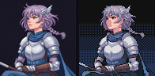 |
| `generic_bow_knight` | bright mint armour, framed forest scene (frame cropped) | 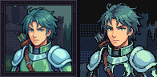 |
| `generic_dark_knight` | saturated violet glow armour, purple backdrop painted in | 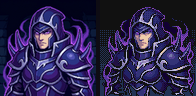 |
| `generic_dancer` | glossy semi-realistic painting, not anime line work | 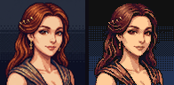 |
| `generic_wyvern_lord` | chunky SNES sprite style, flat shading, odd crop | 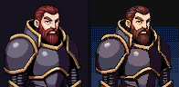 |
| `generic_wyvern_rider` | chunky SNES sprite style, flat shading | 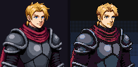 |
| `generic_hunter` | painted forest scene; tree trunks survive the cut-out | 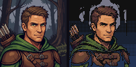 |
| `generic_thief` | wall/tree scene baked into the figure |  |
| `enemy_warrior` | shredded cut-out on white; lower body missing | 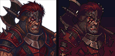 |
| `enemy_great_knight` | old cut-out punched holes through the armour; silhouette rebuilt by closing | 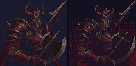 |
| `enemy_paladin` | same shredded cut-out | 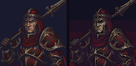 |
| `enemy_entity` | a texture of eyes, not a bust (the boss uses `boss_the_entity`) | 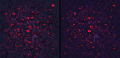 |

The rest of the legacy enemy set (dark red on navy) and the generic set read as one family
after the pass; the 29 rebuilt portraits (lords incl. promoted, bosses, 4 generics) are the
reference quality. Full set: `outliers.webp`.
