# Deeds & Epithets — presentation

Spec: [`docs/specs/deeds-epithets.md`](../../../specs/deeds-epithets.md). Captures come from
`tests/e2e/deeds.spec.js` (run with `DEED_SHOTS=<dir>`), phone at 844×390 (shown at 1.5×),
desktop at 1280×800 and the 640×480 design frame; quantized PNG.

## The deed rite — a title card per deed

A victory's deeds play after the win is saved, before the rewards. Each card is an anime
episode title card in Ink & Ember: an ink slash cuts across the map (gold edge above,
ember below) with faint speed lines and an ember streak running it; the unit's PC-98
portrait stands in the slash and breaks out of it, rim-lit by an ember glow; the kicker
`DEED · BOSSBANE` (Press Start 2P); the name, then the epithet slammed in large in Cinzel
over a dry-brush ember stroke that draws left to right; the ember wax seal stamps the
band's end with the deed's initial and its prestige numeral (a flash and a two-pixel
shake); the lore line in the body face; the Oath teaser for the deed that will swear at
promotion; the count. Prestige V (a boss) brightens the band's edge.

| Phone 844×390 | Desktop 1280×800 |
|---|---|
| 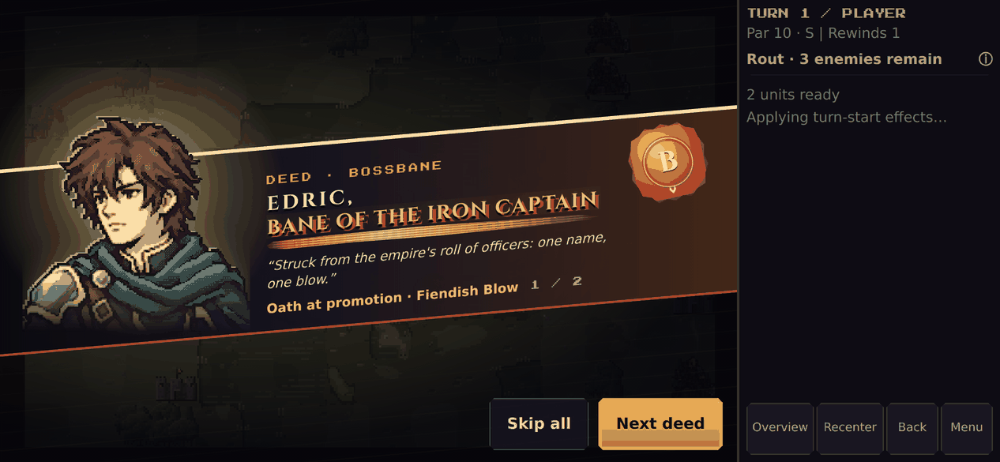 | 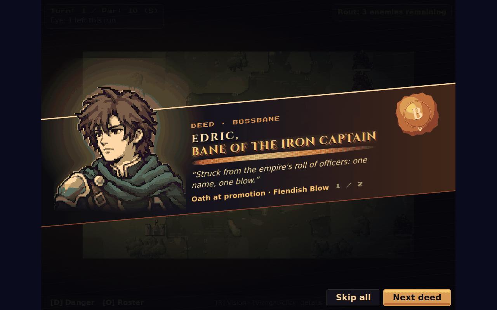 |

Design frame 640×480: 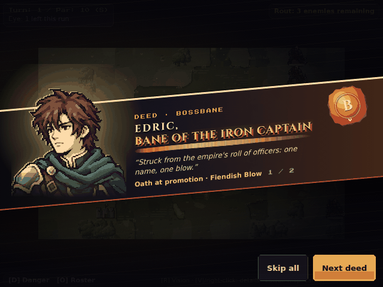

- ~1.8 s per card at normal speed, ~1 s fast; Instant and reduced motion open each card
  revealed. One press (tap, Enter, Space, pad A/B, rail Back) reveals, the next moves to
  the next deed; **Skip all** ends the batch. Effects Low drops the lines, streak, flash
  and shake. The card holds the battle's story input and tears down with the scene.
- A lesser deed earned under a greater title says so ("Earned, and held beneath a greater
  title.") — every deed is celebrated, the roster shows the highest.

## The title follows the unit

| Roster (unit list + Deeds section) | |
|---|---|
| 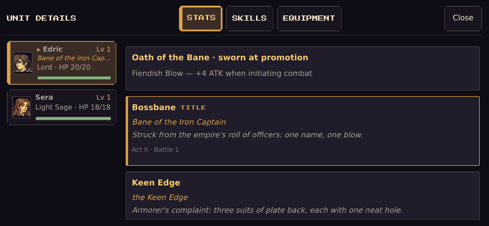 | 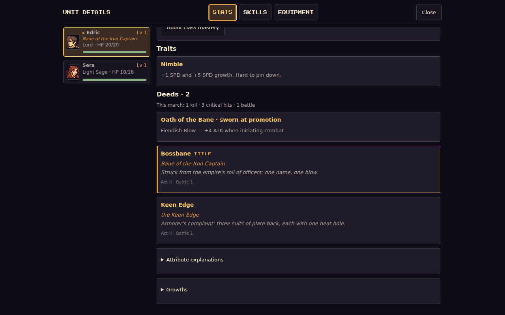 |

Level-up card, crit cut-in and the FALLEN band:

| | |
|---|---|
| 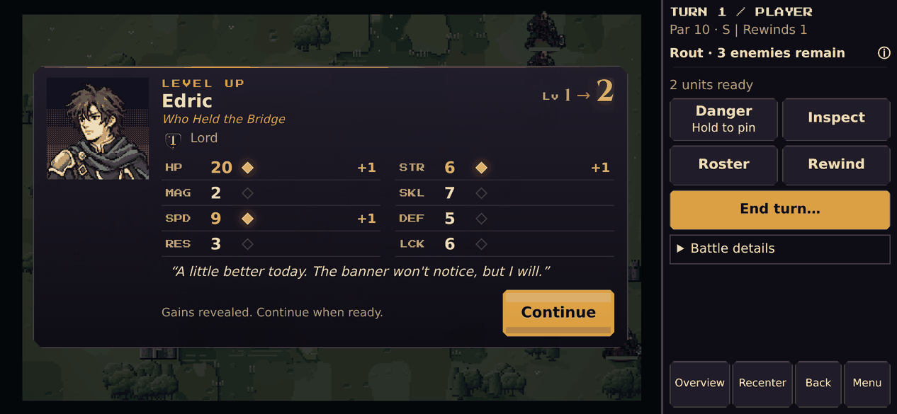 | 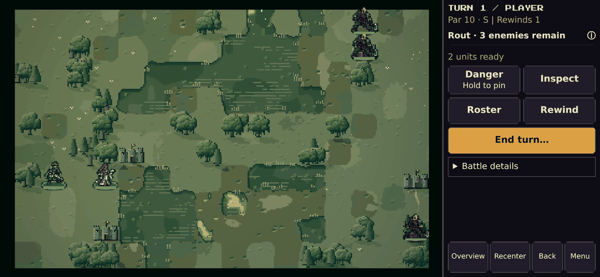 |
| 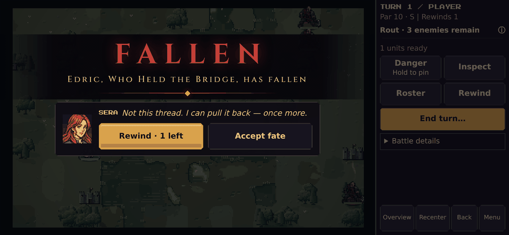 | 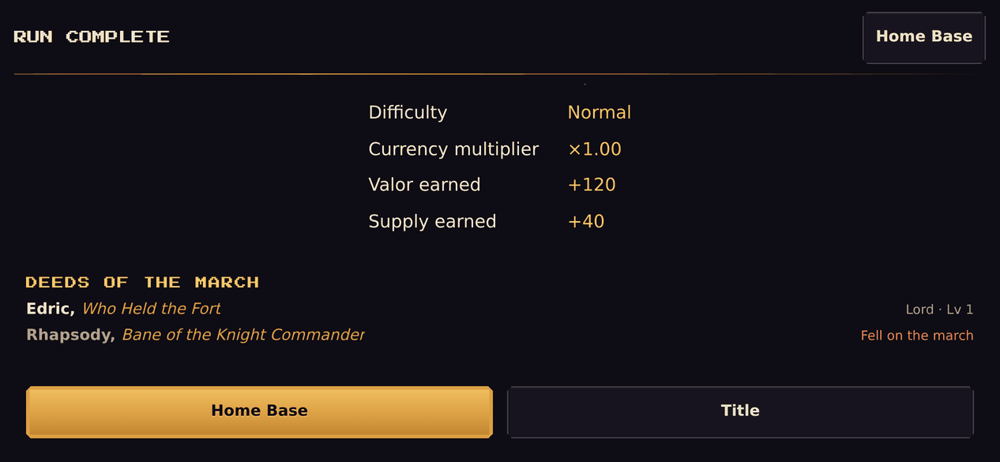 |

The run result lists the **Deeds of the March** (living, then the fallen in crimson);
victory records keep each title.

## Oaths

The promotion chooser shows the Oath on every path (it belongs to the unit, not the
class); the rite seals it last, in ember, after the class's own skills; the kicker names
the unit with its title.

| Chooser | Rite |
|---|---|
| 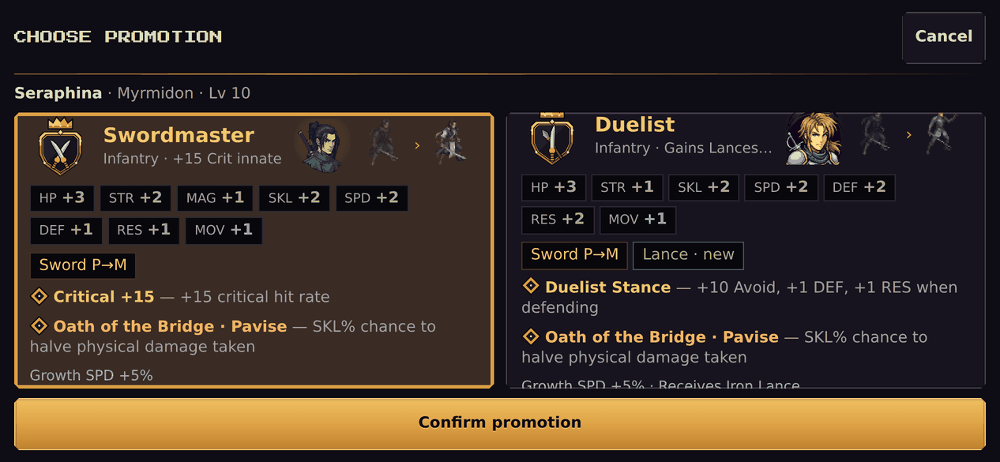 | 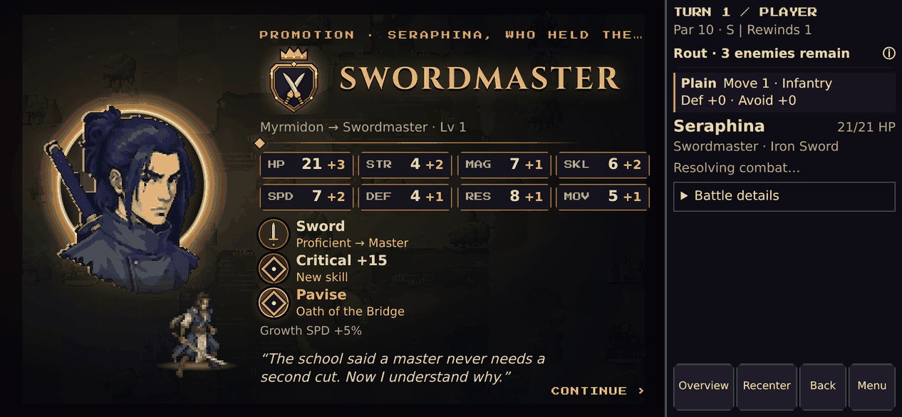 |

Desktop: [chooser](oath-chooser-1280x800.png) · [rite](oath-rite-1280x800.png).

## Implementation map

| Piece | File |
|---|---|
| Rules, recording, commit, Oaths (pure) | `src/engine/DeedSystem.js`, `data/deeds.json` |
| Titles next to names (pure) | `src/engine/DeedTitles.js` |
| Battle hooks | `src/ui/DeedController.js` |
| Rite | `GrowthCeremonyController.showDeeds`, `buildDeedCard`; content `growthContent.deedCardContent` |
| Styles | `src/ui/deeds.css` |
| Roster | `MobileRosterSheet.deeds` |
| Run end, canvas fallback helpers | `src/ui/deedDisplay.js` |
