# Growth moments — promotion rite, crests, level-ups, recruits

> Captures in this folder are a curated subset; see [CAPTURES.md](../CAPTURES.md) for the full sets.

The high points of a run are the moments a unit grows: a promotion, a strong level, a
recruit swearing in. They used to be a monospace banner and a stat list. They are now
ceremonies in the house style (`docs/art-direction/ART_BIBLE.md`): DOM over the map
(the rail stays live), Cinzel only for the ceremonial word, PC-98 portraits at integer
scales, skippable, reduced-motion and battle-speed aware, and presentation only — every
gain is committed, checkpointed or saved **before** its ceremony plays, and nothing here
reads or consumes the battle RNG.

| | Before | After |
|---|---|---|
| Path choice | 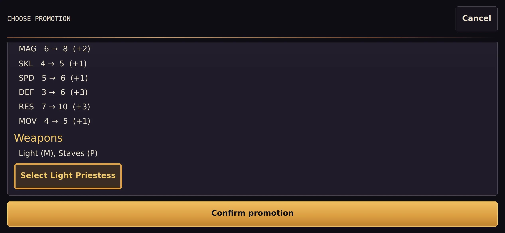 | 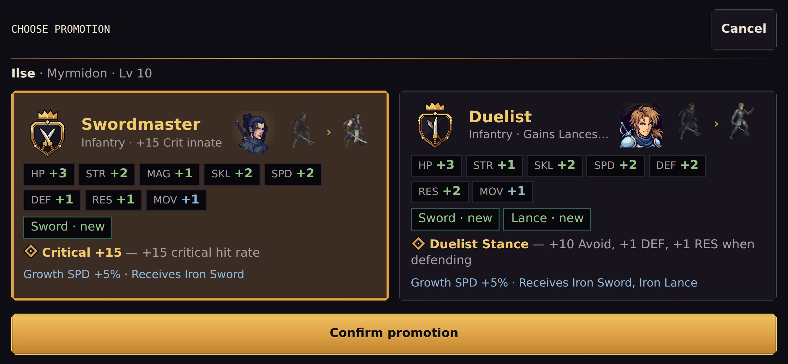 |
| Promotion | 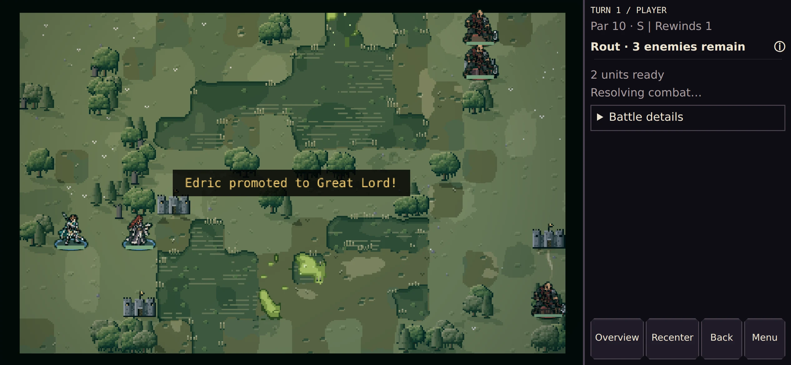 | 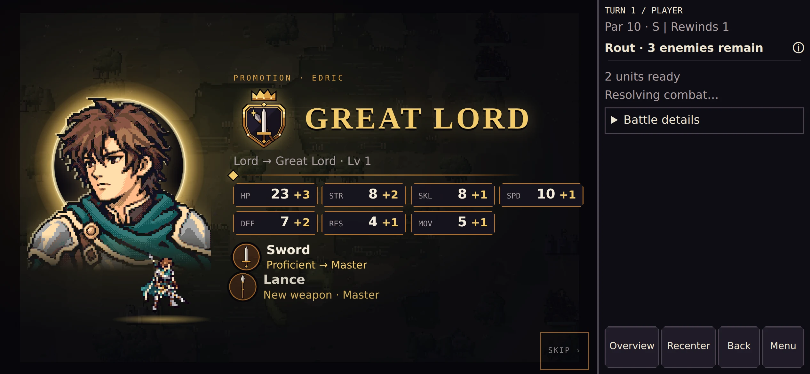 |
| Church | 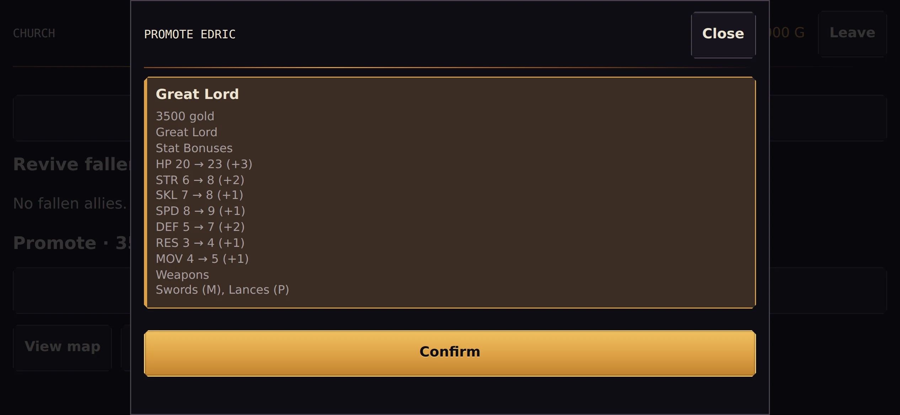 | 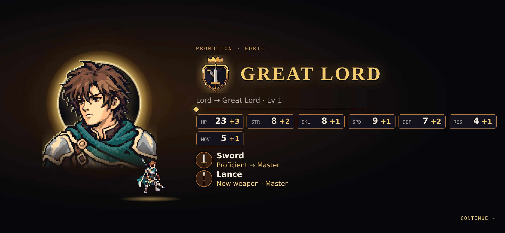 |
| Level-up | 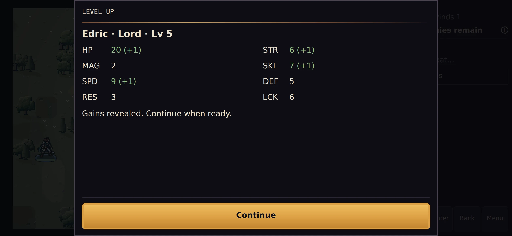 | 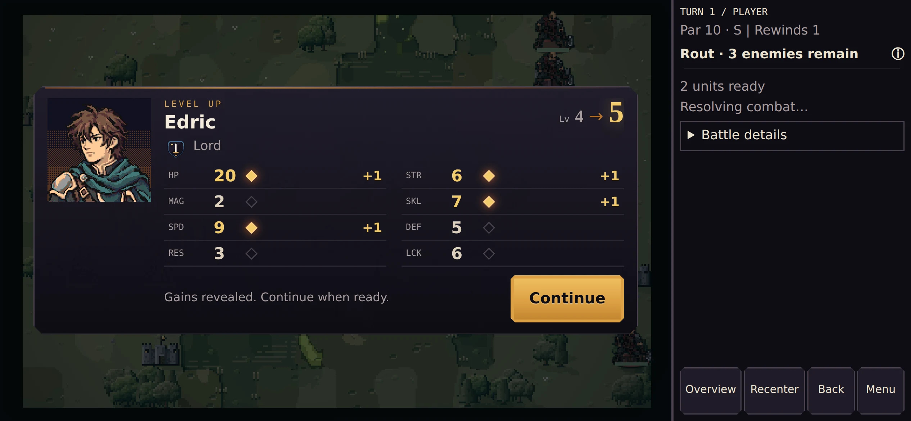 |
| Boss recruit | 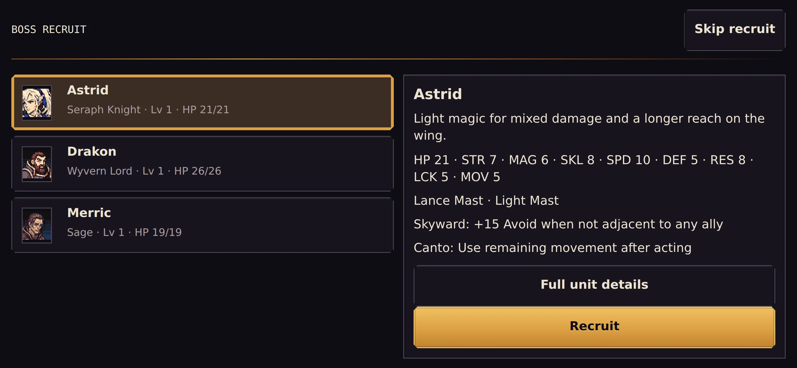 | 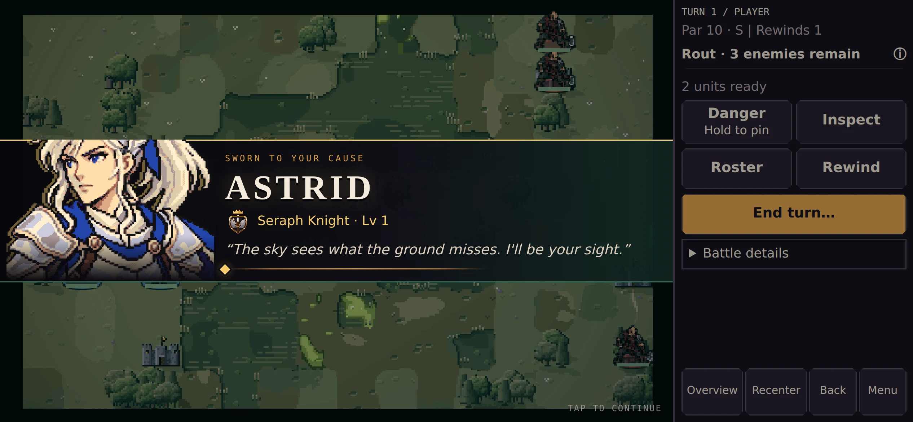 |

Desktop (1280×800): [rite](after/rite-5-end-1280x800.webp) ·
[chooser](after/chooser-battle-1280x800.webp) · [church rite](after/church-rite-end-1280x800.webp) ·
[level-up](after/levelup-perfect-1280x800.webp) · [recruit](after/recruit-boss-1280x800.webp) ·
before: [promotion](before/seal-popup-1280x800.webp), [level-up](before/levelup-1280x800.webp).

Captures are 844×390 at DPR 3 (iPhone landscape, `?mobilePreview=1`) and 1280×800
desktop (`*-1280x800.webp`), made with `tools/art/captureGrowth.mjs` against the dev
server. Before captures are the branch head this work started from.

## 1. Promotion as a rite

**Where:** the battle Master Seal (`PromotionController` → `PromotionChoicePanel`), the
church (`ChurchMenu.promote`) and the roster seal between battles
(`MobileRosterSheet.promoteWithSeal`). Enemy, NPC, recruit-scaling, colosseum and boss
recruit promotions happen in the engine and stay silent.

**The threshold — `PromotionPathChooser`.** One card per path: the class crest, the
promoted portrait and the map sprite before → after (through the battlefield's own
lookup, `battleUnitSpriteKey`: traced → rebuilt → class sprite, dropped cleanly when a
texture is missing), the stat bonuses as chips, weapon ranks (`Sword P→M`, `Lance · new`),
the innate skill, growth and move-type changes and granted weapons. Everything is
projected through the real `promoteUnit` on a detached copy (`growthContent.js`), so the
card shows exactly what the engine applies. Two paths sit side by side at 667–844 px;
one path centres.

**The rite — `GrowthCeremonyController.showPromotionRite`.**

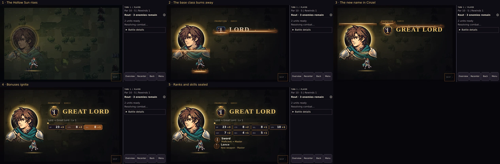

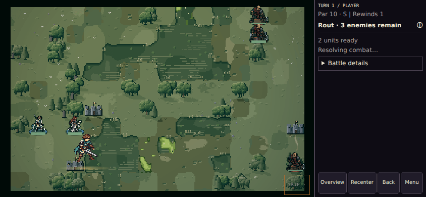

1. The veil falls; the **Hollow Sun** (black disc, thin gold corona) rises behind the
   unit's portrait, which stands rim-lit in its light.
2. The base class **burns away** from the bottom up — name, crest, portrait (generic
   units change portrait with class) and map sprite — along an ember edge with sparks,
   revealing the promoted class.
3. The new class name flares in **Cinzel**.
4. Stat bonuses **ignite** one by one (ember flash → gold, with a tick each).
5. New weapon types and rank-ups are **sealed in** (the crest's weapon charge in a wax
   seal), then new skills (a placeholder seal, see below).

Timing (normal / fast / instant+reduced motion): ~4.5 s / ~2.5 s / end state at once.
The first press (tap, Enter, Space, Esc, pad A/B, rail Back) completes the reveal, the
second continues; on dismissal the dialog role and input are released at once and the
layer fades. It owns the overlay and input-focus stacks, holds the battle's story input
(the rail goes inert, the grid ignores input) and tears down with the scene.

**Checkpoints.** Battle: promotion, seal and weapon grants are applied and
`captureResolvedAction` checkpoints before the rite; a refresh mid-rite resumes with the
promotion and the spent seal exactly once and never replays the rite (e2e
`growth-ceremonies` + `reload-contracts`). Church: gold, promotion and `saveServiceRun`
happen before the rite. Roster: the sheet persists through its context before the rite
(the route map saves the run; rewards pass their own `persist`). Unit test
`GrowthCheckpointOrder` pins the order for all three paths.

## 2. Class crests

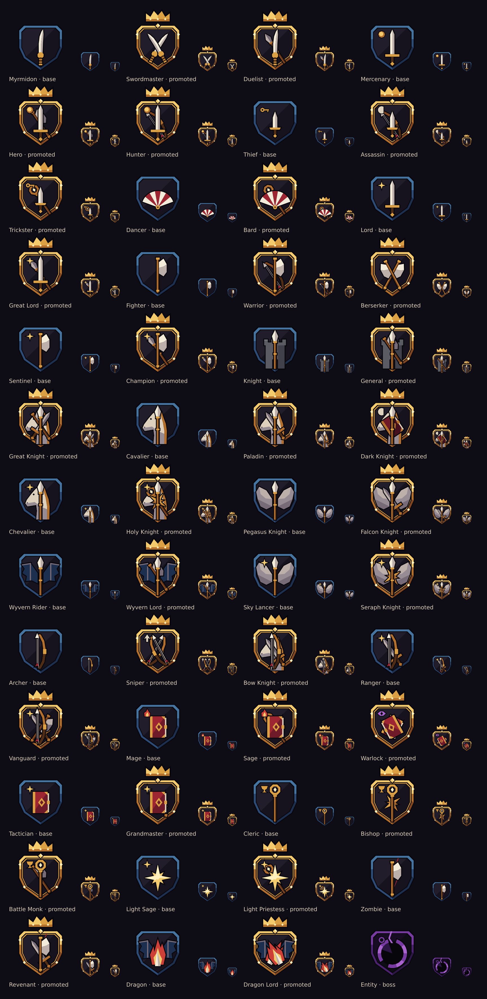

A crest per class (52), composed from the class line (`src/ui/classCrests.js`):

- **Primary charge** — the line's weapon: sword, curved blade (Myrmidon), dagger (Thief),
  lance, axe, bow, tome, staff, star of light, fang (Dragon), fan (Dancer).
- **Twin** — mastery classes that add no weapon type cross two (Swordmaster, Berserker,
  Sniper, Warlock, Dragon Lord).
- **Secondary charges** — the weapon types a promotion adds, crossed behind in muted
  tones: the crest tells the rank story the rite plays.
- **Supporter** — the mount: horse (cavalry), feathered wings (pegasus), leather wings
  (wyvern), tower (armoured).
- **Mark** — the school, in the dexter chief: gold star (lord lines), coin (mercenary),
  key (thief), flame (mage), eye (warlock), chalice (cleric), moon (dark knight,
  assassin), arrowhead (sniper).
- **Frame** — the tier: base is a steel rim; promoted is a gilt double rim with studs,
  keystone and a crown riding above the shield (same shield box, so the rite burns in
  place); the Entity's is cracked unlight.

`tests/ClassCrests.test.js` checks the table against `classes.json`: every class has one,
the frame matches the tier, primary + secondaries are exactly the class proficiencies,
mounts follow move type, and the two paths of every base class differ.

Used in the rite, the path chooser, the level-up card, the recruit card and the roster /
unit detail summary.

### Generated or code-built? The comparison

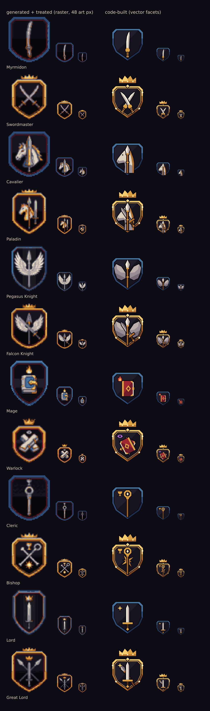

I generated the full series with `gemini-3-pro-image` (`tools/art/crests/generate.mjs`:
two anchors, then every crest with the anchors as references) and treated it into the
palette and a 48 px grid (`treat.mjs`). Raw and treated images are in
`docs/art/crests-gen/` (raw downscaled to 512 px; `raw-contact.png`).

- **Generated** has more charm at ceremony size (the horse heads and wings especially),
  but the series drifts: shield widths and crown placement vary, some came back on white,
  the lord line got a crown at base tier, and at 24–48 px the treated 48 px raster turns
  to mush.
- **Code-built** reads at every display size (24 px roster chip to 160 px ceremony, one
  definition, crisp at any DPR), is consistent by construction, stays tied to the data
  (a new class or proficiency changes its crest), weighs nothing (no download, no
  texture memory) and can be animated (the burn).

**Chosen: code-built**, with motifs lifted from the generated series (the bone horse
head, the crown above the shield for the promoted tier). The generated set remains a
reference for a future hand-painted ceremony-size variant.

## 3. Level-up

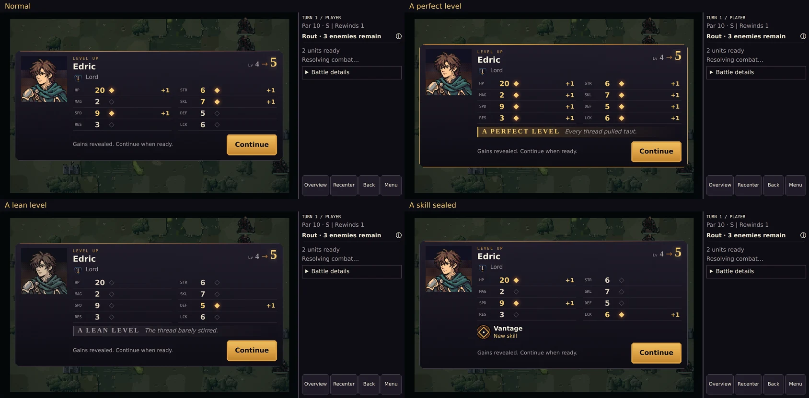

`LevelUpPopup` (DOM) now opens the level-up card: PC-98 portrait on its plate at 96 px ×
integer scale, crest and class, **Lv 4 → 5** (the number in Cinzel), eight stat rows
whose gained pips **ignite in ember** in order with a tick each, then:

- **A perfect level** (every stat grew): a gold beat and the card glows.
- **A lean level** (one stat — the engine's floor): an ash beat, the portrait dims.
- **New skills** are sealed at the foot.

Fast: ~0.4 s for a typical four-gain level at normal speed, ~0.2 s at fast; **Instant and
reduced motion show the end state at once** with no ticks. One press reveals, the next
continues (Instant: one press). The queued popups (`presentQueuedLevelUps`) are
unchanged: they present after the resolved-action checkpoint, one card per level; a
refresh never replays or loses a gain. Colosseum level-ups (previously text lines) now
play the same card after the fight is settled and saved.

## 4. Small beats: skill learned, weapon rank up, mastery

- **Weapon rank up / new weapon type**: sealed in the rite (wax seal with the crest's
  weapon charge; `Proficient → Master` / `New weapon`).
- **Skill learned**: sealed in the rite and at the foot of the level-up card; a scroll
  taught in the roster stamps a non-blocking **Sealed** band.
- **Class mastered**: a sealed band over the rewards.
- Skill glyphs are a **placeholder hook**: `.gr-glyph--skill[data-skill-id]`
  (`growthGlyphs.js`) shows a neutral seal diamond until the icon study lands; it can
  fill the hook without touching these flows.

## 5. Joins your army

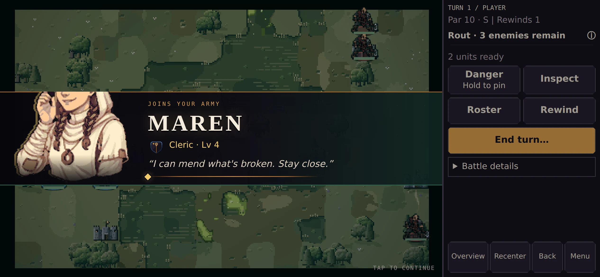

`showRecruit` — the portrait breaking the band (like the boss card, verdigris-to-gold for
an ally), **NAME** in Cinzel, crest · class · level, and one line from
`data/dialogue.json` (the lord's own `lordRecruitLines`, else the class's
`recruitLines`, else the base class's; picked by a stable name hash, never the RNG or
the narrative log). A lord's **legendary trait** is sealed on the card. Used by Talk
recruits (in place of the dialogue line, before the join is applied — the same
checkpoint semantics as before), boss recruits and the third-lord arrival (after the
join is saved) and colosseum hires (after the hire is saved). Leaves by itself after
~3.6 s or on a tap.

## 6. Mechanics audit

Walked every mechanic the player meets and compared its presentation with the ceremony
bar. Fixed the three biggest gaps (with before / after); the rest are prioritised below
with sketches.

### Fixed

**A. Battle notices** — every `showBriefBanner` (village saved / razed, bandits, status
staff results, promotion errors, dropped skills…) was a monospace box in the middle of
the map. Now a toned notice band high over the map (verdigris gain, crimson loss, ash
miss, gold otherwise), body face, same reading window (not shortened at Instant — it
carries information), stacked, never blocking.

| Before | After |
|---|---|
| 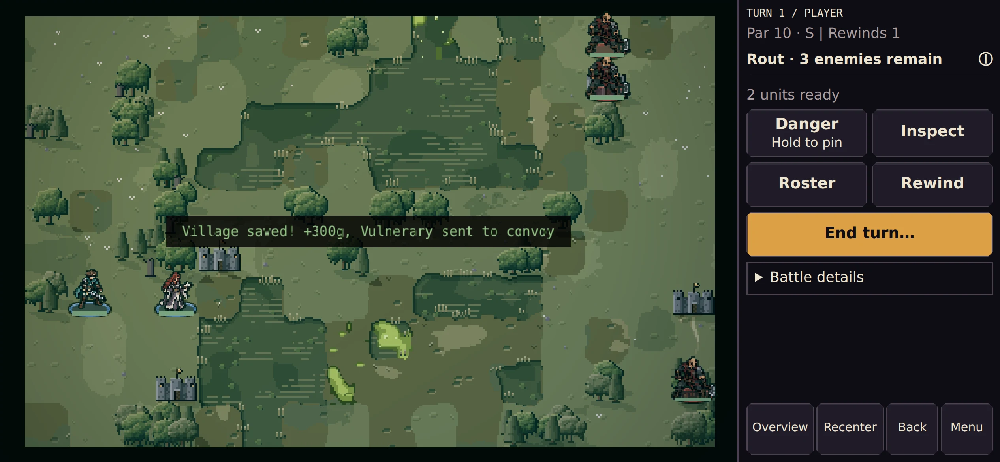 | 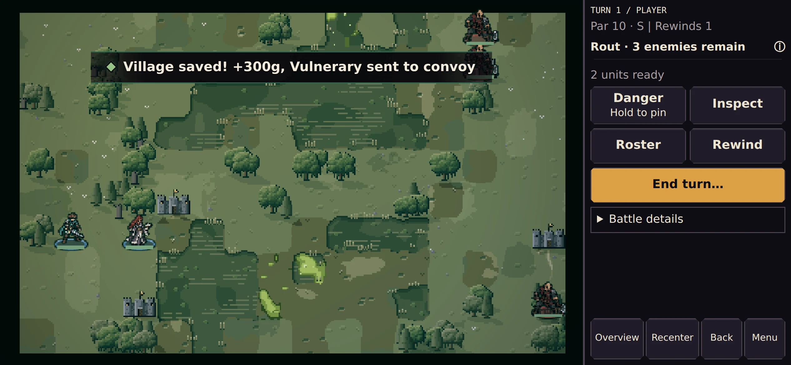 |

**B. Reinforcement arrival** — a tiny orange monospace line at the top; you had to find
the new enemies yourself. Now one crimson thread band (**REINFORCEMENTS** · *2 enemies
arrive* · *a bandit makes for the village*) and, on each arrival you can see, a crimson
thread dropping onto its tile and a ring snapping outward (it outlasts the band).
Fogged arrivals are counted but never marked (`ReinforcementPresenter`).

| Before | After |
|---|---|
| 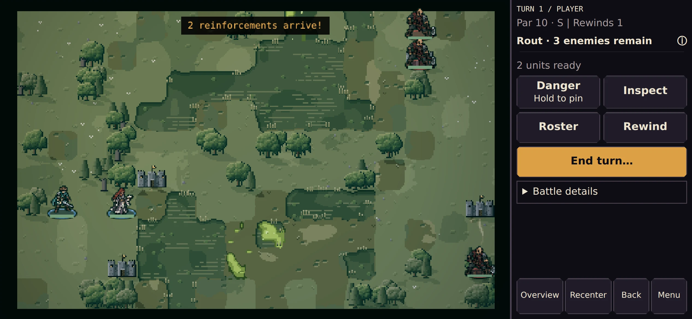 | 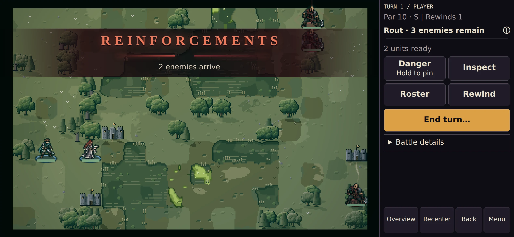 |

**C. Status conditions on units** — "Zzz", "X", "Ac", "Rt" in 10 px monospace, colliding
when a unit had two and lost on grass. Now 11×11 pixel seal badges (sleep: crescent;
silence: sealed mouth; acid: drop; root: knot) baked in code on the tile grid, centred and
spaced (`StatusBadges.js`).

| Before | After |
|---|---|
| 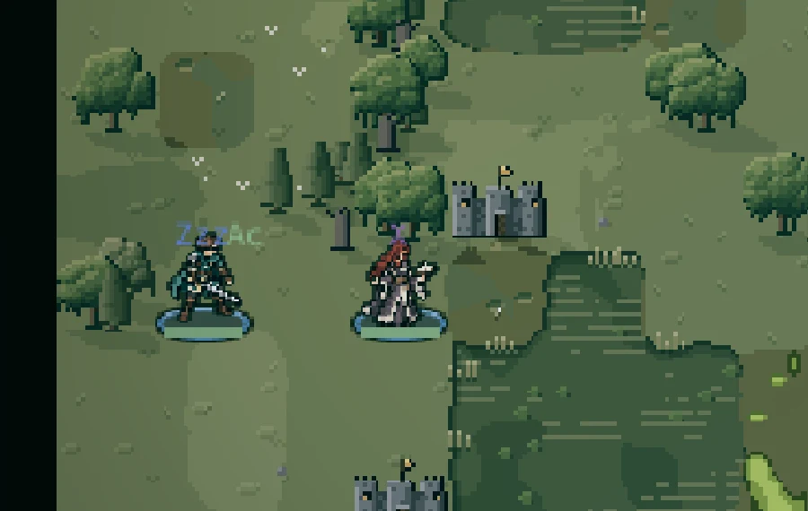 | 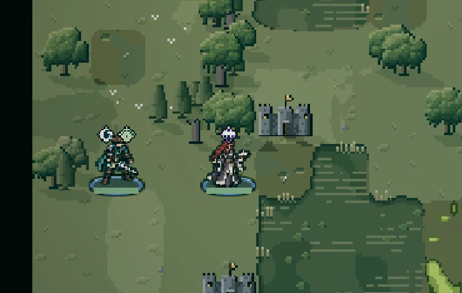 |

Also: legendary lord traits are now announced on the arrival card, and colosseum levels
and hires got their ceremonies (above).

### Still below the bar (prioritised)

1. **Ballista fire** — a damage number appears on the target; no bolt, no source, no
   beat. *Sketch:* a crimson (enemy) / gold (captured) bolt thread from the ballista tile
   to the target, 80 ms hit-stop, the number in the combat style; capture gets a gold
   ring and a notice. Coordinate with the combat FX owner (`CombatFxController`).
   ```
   [B]====---- - -  >  (X) -12
   ```
2. **Fog reveal** — enemies pop in (`setVisible`) as fog recedes. *Sketch:* newly seen
   enemies get a one-shot crimson glint; two or more at once raise a notice ("3 foes
   sighted"); fog edges fade over 150 ms instead of snapping.
3. **Enemy affix pips** — 4 px squares above the unit, unreadable on a phone; the bible
   says affixes read as threads snapping. *Sketch:* one frayed crimson/violet thread per
   affix under the HP bar; the first sighting of an affixed foe raises a notice naming it;
   the inspection panel shows the affix with its thread mark.
   ```
   [HP ▮▮▮▮▮▯▯]
    ~~/\/~~   (fractured thread = 1 affix)
   ```
4. **Turn par and rank** — shown as "Par 10 · S" in the rail and on the victory band;
   crossing par (rank drops, XP/gold decay begins at +5) is silent until the boss enrages.
   *Sketch:* an ash notice the turn the projected rank drops ("Past par · Rank A") and an
   ember one when decay begins; the rank glyph in the rail dims a step.
5. **Vision rewind** — the timeline view is good; the rewind itself snaps the board.
   *Sketch:* the gold thread unravels back to the chosen turn (400 ms wipe, reduced
   motion: a fade) with **THE THREAD RETURNS · Turn n** as a thin band.
6. **Reclass seals** — still the plain picker with a text preview (the promotion chooser
   treatment would carry over: crest, sprite before → after, rank chips) and no beat on
   confirm (a shorter rite without the Hollow Sun: crest swap + sealed ranks).
7. **Village visit** — now a verdigris notice, but the "+300g" float is monospace and the
   village tile does not change state visibly. *Sketch:* the float in the combat number
   style, the tile's lights go warm (visited) or dark with embers (razed).
8. **Terrain hazards** (lava, acid) — a tint and a monospace number. *Sketch:* the number
   in the combat style; acid adds the acid badge (done) with a drip; lava an ember flare.
   (Terrain art itself is out of scope.)
9. **Shrine / blessings, ruins, colosseum menus** — reachable, readable DOM menus in the
   Reliquary kit, below the ceremony bar only at their moments of choice: a blessing taken
   could stamp a sealed band under the Hollow Sun; the arena's fight result could use the
   victory band (VICTOR / FALLEN IN THE PIT).
10. **Generic portraits change identity on promotion** — generic units' portraits are
    keyed by class, so a promoted Myrmidon becomes a different person (the rite burns one
    face into another). Traced sprites already keep identity by name hash; portraits could
    do the same (pick among the class line's portraits by name).

## Implementation map

| Piece | File |
|---|---|
| Crest table (pure) | `src/ui/classCrests.js` |
| Crest drawing (SVG facets) | `src/ui/crestArt.js` |
| Content, projection, timing (pure) | `src/ui/growthContent.js` |
| Rite, level-up card, join card, sealed band | `src/ui/GrowthCeremonyController.js`, `src/ui/growth.css` |
| Path chooser | `src/ui/PromotionPathChooser.js` |
| Map sprite → DOM image | `src/ui/growthSprites.js` |
| Weapon seals, skill glyph hook | `src/ui/growthGlyphs.js` |
| Notices, reinforcement band | `src/ui/CeremonyController.js` (`showNotice`, `showArrival`), `src/ui/ceremony.css` |
| Arrival marks | `src/ui/ReinforcementPresenter.js` |
| Status badges | `src/ui/StatusBadges.js` |
| Crest study tools | `tools/art/crests/{generate,treat,sheet,spec}.mjs` |
| Captures | `tools/art/captureGrowth.mjs` |

New depth token `DOM_UI_DEPTHS.RITE` (1300): the rite plays over the church or roster
menu that confirmed it.

## Verification

- Unit: `ClassCrests`, `GrowthContent`, `GrowthCeremonyController`, `GrowthSprites`,
  `GrowthCheckpointOrder`, `BattleNoticesAudit` (crest mapping against the data, projection
  without RNG, two-stage dismissal, Instant / reduced motion / effects quality, input
  release and scene-shutdown cleanup, checkpoint order for every path).
- E2E `tests/e2e/growth-ceremonies.spec.js`: battle seal with the path chooser, roster
  seal, church, refresh mid-rite (battle and church), level-up through a real kill at
  normal / fast / instant. `progression-reveal` and `service-audit` follow the new card
  and rite; `reload-contracts` ("refresh during promotion popup") now exercises the rite.
