# Items, rewards and services — art direction study

> **Study, not production.** Direction options for the owner to choose from. Nothing here
> changes game code: the mockups are the real game DOM (dev routes) with the proposed art
> composited on top by `tools/art/icons/study/mockups.mjs`. House style:
> [`ART_BIBLE.md`](../ART_BIBLE.md) (Ink & Ember, the Hollow Sun, key light upper-left).

**The ask.** Gambler's Coin showed that most of the run's rewards have no art. Blessings,
rewards, forge, church, items and upgrades all need it, and the owner asked for a bold pass,
with image generation for anything procedural can't reach.

**Recommendation in one line.** Adopt **A · Forged in code** as the item icon system: all
239 icons are drawn procedurally from `data/*.json` by one grammar. Frame them in the
plaque language of **C** (sockets whose shape is the category and whose rim is the tier).
Keep **generated PC-98 painting** for the handful of large moments: 23 blessing cards and 6
service vignettes. See [§4](#4-recommendation-and-production-plan).

Captures: phone 844×390 (`?mobilePreview=1`, DPR 3, exported at DPR 2) and desktop 1280×800.
Game fonts load in every capture (see [Reproduce](#reproduce) for the dev-server note).

---

## 1. Audit — what the flow shows today

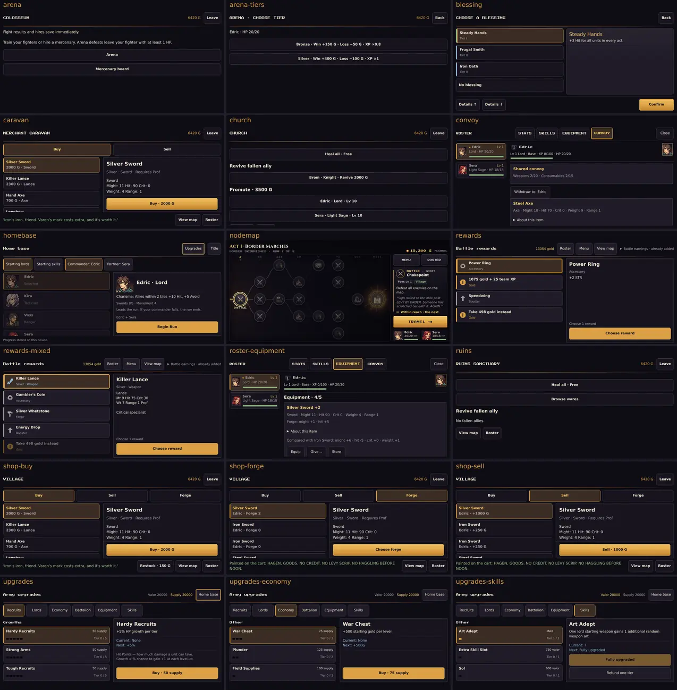

Desktop: [audit-desktop-1280x800.webp](audit-desktop-1280x800.webp)

| Surface | Code | Today | Gap |
|---|---|---|---|
| Battle rewards | `MobileRewards`, `rewardDisplay.js` | Rows with a 16px monochrome SVG glyph, one of 10 per category. This is **the only item imagery in the whole loop.** | Every weapon shows the same glyph. Tier is only a coloured word. No reveal. |
| Shop buy / sell / forge | `ShopMenu` | Text rows: name, price, type. The detail is a stat block. | No item art. The item lore (rewritten in #70) sits behind "Item story". Forge has no feedback. |
| Caravan / Ruins market | `ShopMenu` (title swap) | Same as the shop | The places have no identity of their own |
| Church / Ruins sanctuary | `ChurchMenu` | Three text sections of full-width buttons | Nothing says "church". The promotion rite after it is lavish (growth study); the room around it is empty. |
| Colosseum / arena tiers / mercenaries | `ColosseumOverlay`, `ArenaMenu` | Two text buttons, then tier text | No gate, no stakes |
| Blessing select | `RunSetupMenu` + `BlessingSelectScene` | A list with a 4px tier stripe, "Tier II" in small print, and the cost as a note under the description | 23 run-shaping blessings with shrine lore look like a settings list. The cost does not read as a price. |
| Army upgrades (72) | `MobileUpgradeMenu` | Text rows and square pips | 72 upgrades in 6 categories, none with an icon. Buying one has no moment. |
| Roster equipment / convoy | `MobileRosterSheet` | Text cards | Same icon gap as the shop |
| Home base, node map | `MobileHomeBase`, Loom | Portraits and node icons | Covered by earlier work |
| Legacy UI icons | `BootScene` loads 37 `icon_*` | Nothing | **Never displayed anywhere**, but loaded at every boot: 284 KB download and 37 separate textures (≈ 0.6 MB decoded). See the [sheet](audit-legacy-icons.webp). Delete them. |

Surfaces in data with no art today: 130 weapons (8 families plus 49 scrolls), 15
consumables, 33 accessories, 5 whetstones, 6 imbuing stones plus the Prismatic stone, 23
blessings and 72 upgrades. On desktop, 50–70% of every service screen is empty ink.

---

## 2. Icon grammar — three directions

The same 24 items in each direction, at 24/32/48 px on a raised panel. The 24 span the
categories: eight weapon families including staff, tomes and scrolls, plus supplies,
seals, boosters, accessories (Gambler's Coin among them), a whetstone, an imbuing stone,
a blessing and two upgrades.

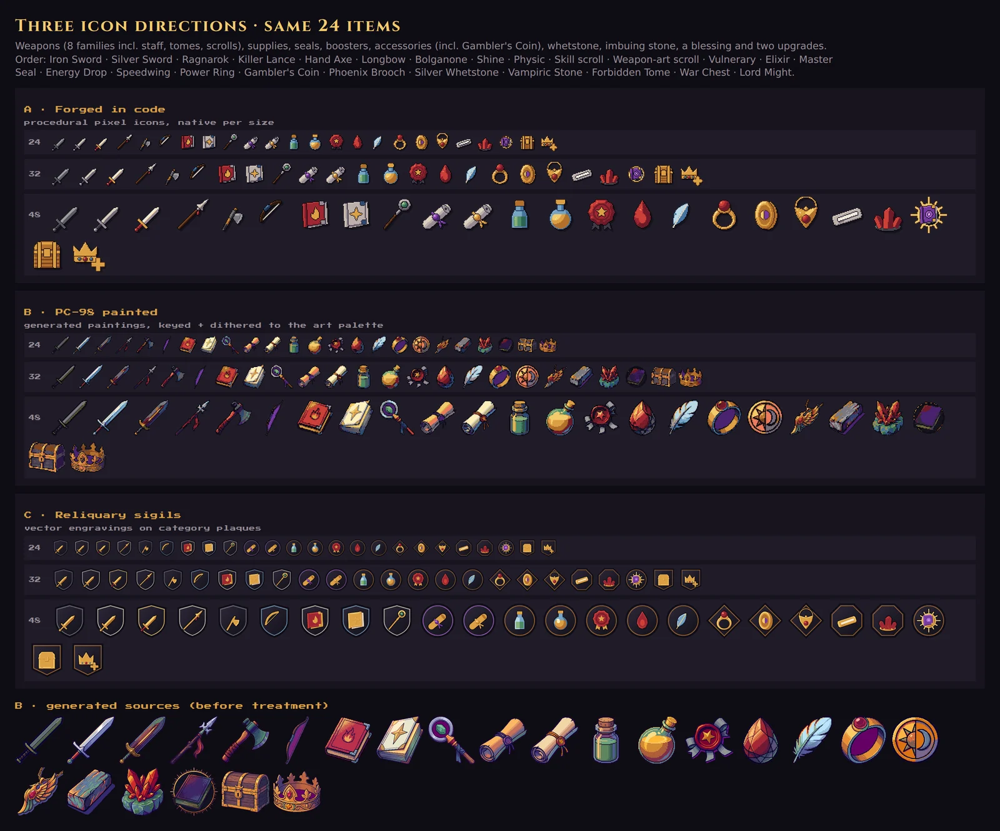

Each direction in the real shop (phone):

| A · Forged in code | B · PC-98 painted | C · Reliquary sigils |
|---|---|---|
| 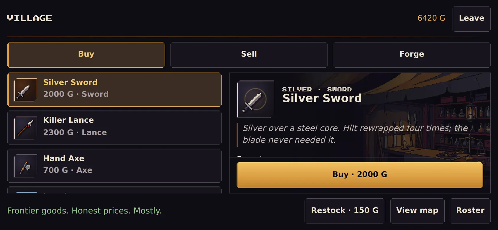 | 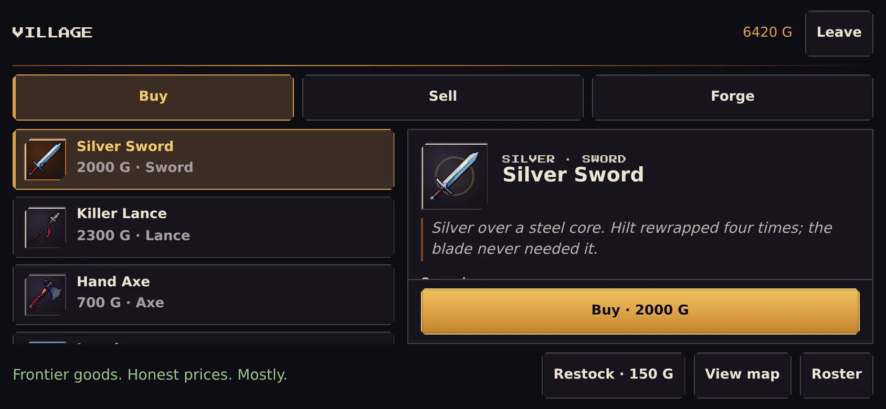 |  |

### A · Forged in code (procedural pixel icons)

`tools/art/icons/lib/pixelIcon.mjs` is a small renderer with no dependencies. An icon is a
stack of parts: shapes in a 32-unit design space, each with a material ramp and a shading
model (sphere, cylinder, ridge, dome, bevel or flat). Each display size is rasterized
natively, so a 16px icon is drawn as a 16px icon, with whole-pixel lines and no resampling
blur. The steps: 4×4 coverage with thin strokes forced to 1px, then normals, then the
ART_BIBLE key light from the upper left, mapped to ramp levels. After that come cast
shadows of upper parts, separator lines, orphan clean-up, a key-light rim, specular
glints, a selective outline and a drop shadow.

`lib/itemGrammar.mjs` maps data to icons with one rule set:

- **silhouette = family**: sword, lance, axe, bow, tome, staff, breath stone, scroll,
  vial, seal, ring, pendant, medal, band, coin, gem, whetstone, crystal…
- **metal = tier**: Iron dull grey, Steel cold blue, Silver bright, Legend gilt with an
  ember core, Rare (enemy issue) blackened with a violet glint.
- **accent = what it does**: stat colours on gems, boosters and whetstones (STR blood,
  MAG unlight, SPD sky, DEF steel, RES lilac, SKL pearl, HP verdigris). Element colours on
  tomes and stones. Specials on weapons: crit = blood, magic = sky, poison = verdigris,
  drain = unlight, effective = leaf.
- **variant = mechanics you can see**: throwable = short, brave = twin blade or broad head,
  reaver = serrated, Hammer = a hammer, long range = a bigger bow, close range = recurve.

The whole catalog, from data:

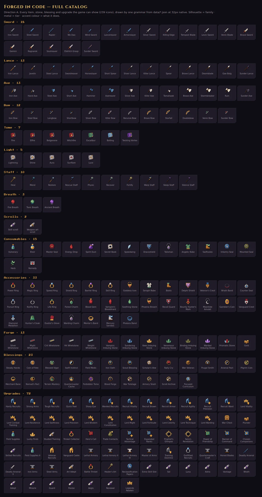

Sizes on the four real surfaces (ink, panel, raised, selected), at DPR 2:
[icons-a-sizes.webp](icons-a-sizes.webp)

- **For:** covers every item today, and every item added to `data/*.json` later, with no
  artist. One light, one palette and one pixel grid, the same as terrain and sprites. Legible
  at 16px. Deterministic. Tiny: all 239 icons are one palette PNG atlas per size, 11 KB at
  16px, 25 KB at 32px, 42 KB at 48px.
- **Against:** a crafted rather than painted look. At 48px it reads as a clean SNES item
  sheet, not as a painting. Some families need a second pass: the recruit helm's plume is
  too small to carry its stat colour, blessing and upgrade icons repeat, the Skills tab is
  all scrolls, and the tome emblem is lost at 16px.

### B · PC-98 painted (generated)

`study/genIcons.mjs` generates one image per item with Gemini on a flat ground
(`tools/art/gen/geminiImage.mjs`, provenance logged). The ground is flood-filled away
from the border, the image is cropped and resampled per size, and the result goes through
the PC-98 figure pass (`tools/art/pc98`: own palette, cel flatten, ordered dither, ink)
with the palette snapped onto the art-bible ramps.

- **For:** the richest result at 48px and up. The generated Gambler's Coin (a split sun and
  violet moon) is the best single icon in the study. It shares its language with the PC-98
  portraits.
- **Against:** inconsistent between items (angle, scale, how much light each takes) and
  mushy at 24px and below. Every item needs a curated generation, 239 now plus every
  future item, and a re-roll whenever one goes wrong. The treatment cannot fix a bad source
  (Longbow). The Pro model's daily quota (250 requests, shared by every agent) ran out
  during this study. The last three icons and all the moments art came from the Flash model.

### C · Reliquary sigils (vector)

`lib/sigil.mjs` renders the same geometry as A as flat-faceted vector engravings on a
category plaque, the class-crest language of `src/ui/crestArt.js`. The plaques: weapon =
heater, supply = roundel, accessory = lozenge, forge = octagon, blessing = sun disc,
upgrade = pennant. Tier is the rim colour. Everything is struck in one engraving metal plus
a single accent colour.

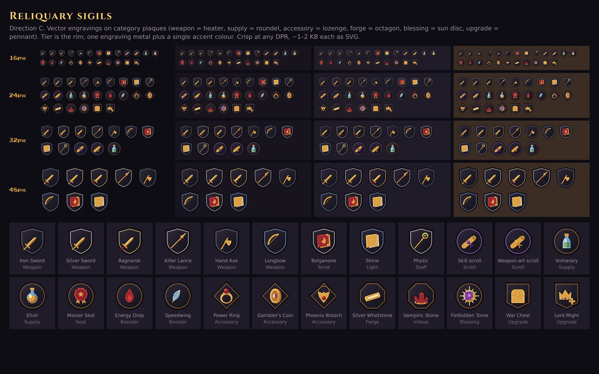

- **For:** crisp at any DPR, about 1–2 KB of SVG each, and no raster memory. The category
  shows at a glance, and it matches the crests and the reliquary UI.
- **Against:** the plaque takes up about a third of the icon, so at 24–32px the object is
  small. Items look alike ("everything is gold"). It reads as UI chrome rather than loot:
  heraldry, not treasure.

---

## 3. Moments

### Blessings as cards

Tarot-like cards replace the list. Each has a tier frame (I silver, II bronze, III gilt,
IV ember with dotted numerals), the name in Cinzel over the art, and the boon in body
text. The **cost is a wax seal**: crimson with the cost when there is one, verdigris
"No cost" when there isn't. "No blessing" becomes a plain button. Two ways to make the
card art:

| Generated painting (PC-98 treated) | Procedural emblem (A's boon icon in the Hollow Sun) |
|---|---|
| 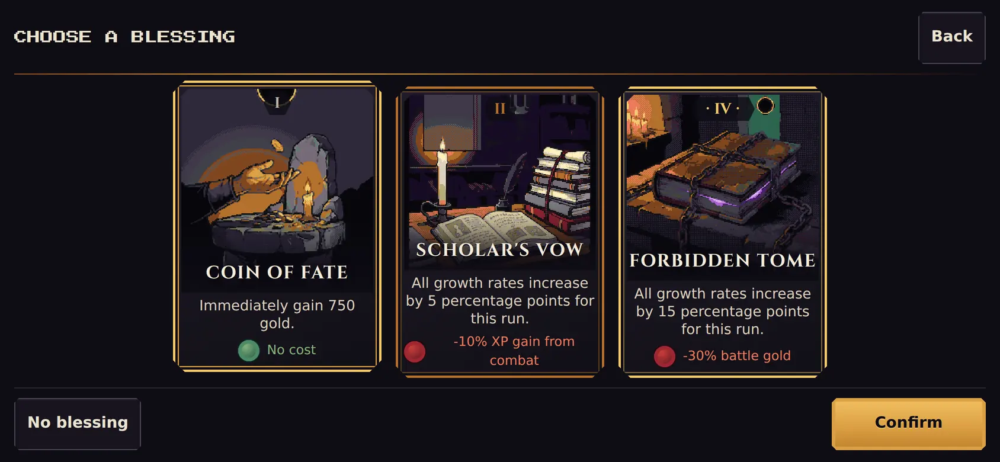 | 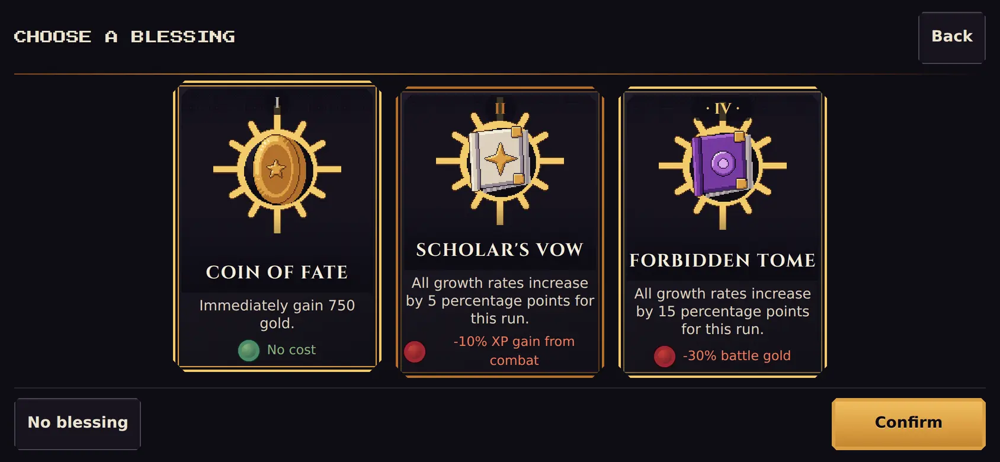 |

Desktop: [painted](mock-blessing-painted-1280x800.webp).
Generated art for eight of the 23 blessings, raw (top) and treated (bottom), with prompts
taken from the new shrine lore:

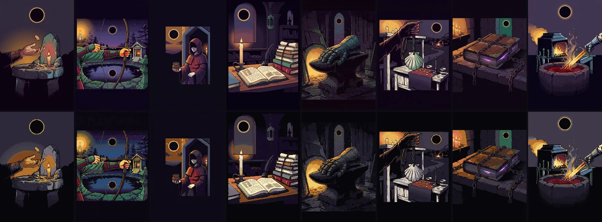

The painted cards are the moment the owner asked for: a run starts at a shrine. The
emblem cards are the fallback for any blessing without a painting yet.

### Service vignettes

A PC-98-treated generated painting per service (forge, church, shop, colosseum, ruins,
caravan). All 480×270 palette PNGs, 17–26 KB each.

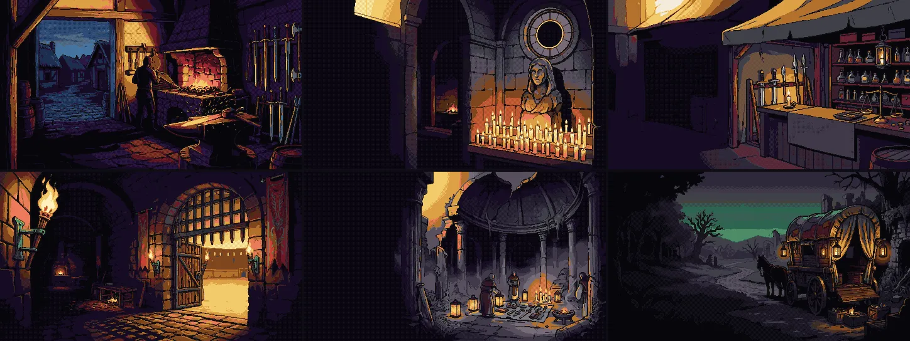

Phone: the scene sits behind the detail pane or the menu, fading to ink where text sits.
Desktop: a header band with the service name in Cinzel, which fills the empty top of the
screen. The forge adds ember sparks, the church a candle flicker. In production these are
CSS/DOM motes that respect reduced motion; they are drawn static here.

| Forge (phone) | Church (phone) |
|---|---|
| 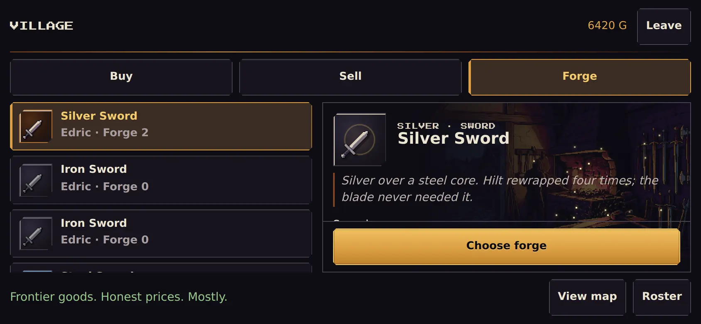 | 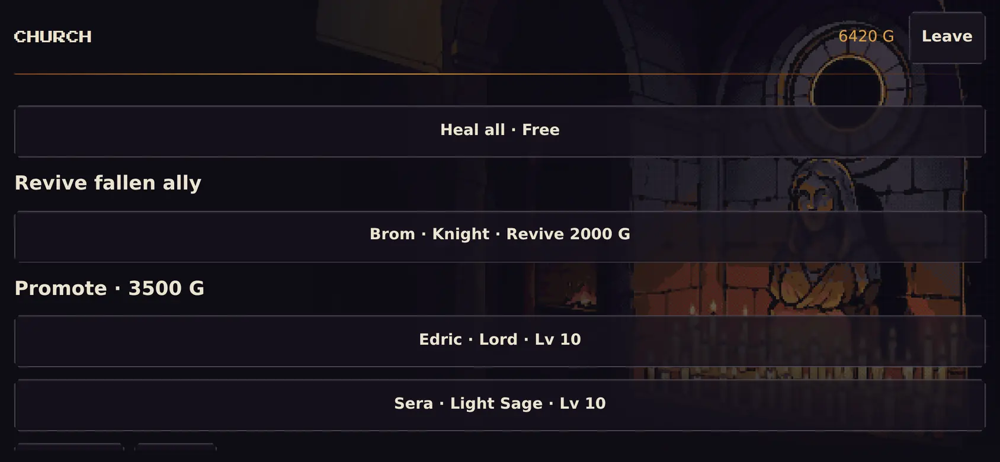 |
| **Colosseum (phone)** | **Caravan (phone)** |
| 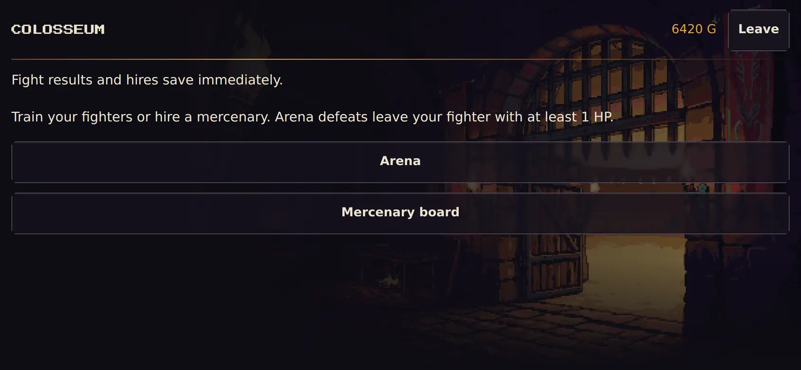 | 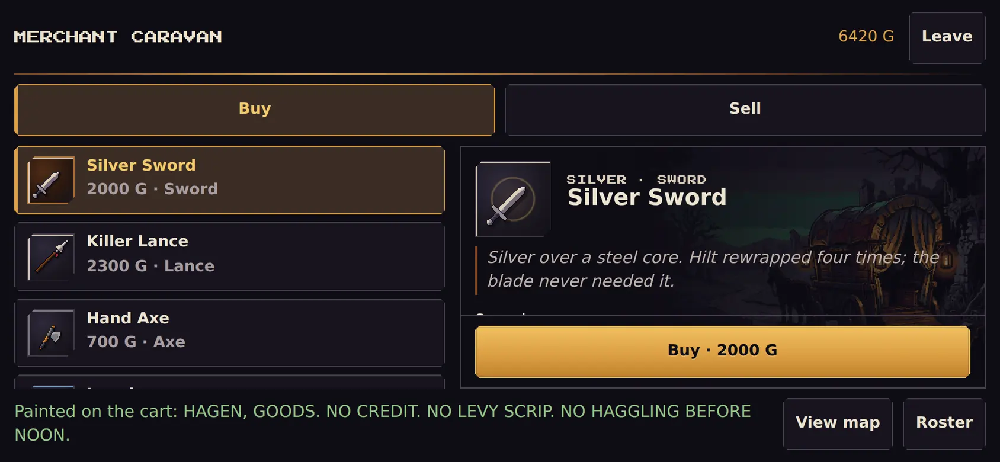 |

Desktop: [shop](mock-shop-pixel-1280x800.webp) · [forge](mock-forge-pixel-1280x800.webp) ·
[church](mock-church-pixel-1280x800.webp) · [colosseum](mock-arena-pixel-1280x800.webp) ·
ruins (phone): [ruins](mock-ruins-pixel-844x390.webp)

### Reward reveal

Spoils arrive face down: Hollow Sun card backs, with the detail pane veiled until the
first card turns. Cards turn in order. The rarest takes an ember flash, then the chosen
reward's hero shows at 96px on a corona pedestal with its lore line. Each row gets a 48px
socket with the tier rim and a Press Start kicker in the tier colour. Production timing:
about 180 ms per card with a 90 ms stagger. Tap skips to the end state; so do reduced
motion and Instant speed. The rewards are already saved before the reveal plays, the same
rule as the growth ceremonies.

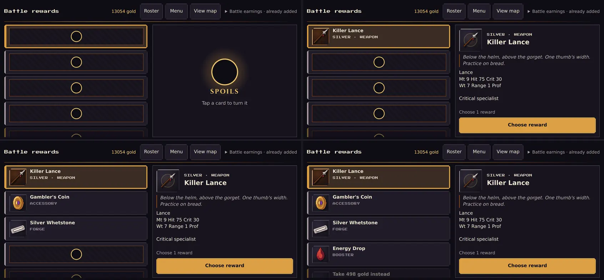

Settled state, phone: [rewards](mock-rewards-pixel-844x390.webp) · desktop: [rewards](mock-rewards-pixel-1280x800.webp)

### Upgrade purchase

Every upgrade gets an icon: category silhouette plus stat colour, with a growth arrow or
a plus badge. Pips become gems. On purchase the next gem ignites, the row socket flares
ember, and the new tier is stamped across the detail in Cinzel.

| Upgrades | Purchased (stamp + ignited pip) |
|---|---|
| 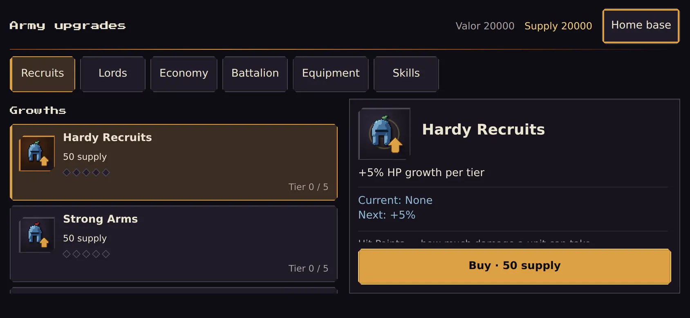 | 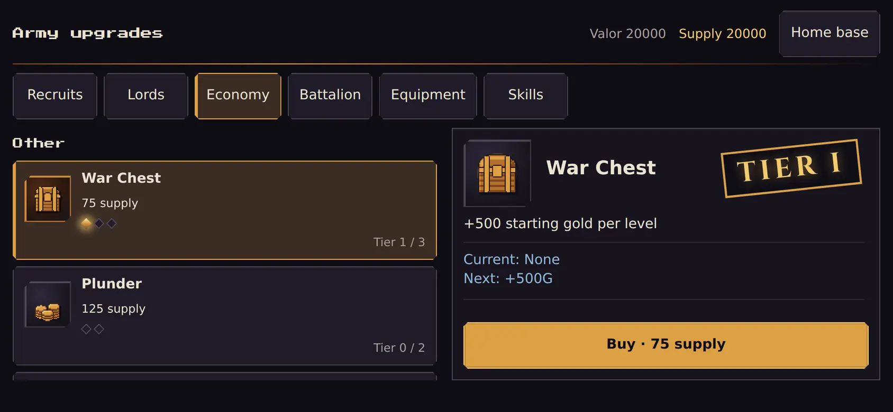 |

Skills tab (every row is a scroll, which is the weakest part of the grammar):
[skills](mock-upgrades-skills-pixel-844x390.webp) · desktop: [upgrades](mock-upgrades-pixel-1280x800.webp)

---

## 4. Recommendation and production plan

**Direction: A for every icon, C's plaque language for the sockets, and generated
paintings only for large moments.** A is the only direction that covers the whole
catalog at 16–48px, keeps working as data grows, and costs almost nothing in memory. It
also follows the owner-approved "art built procedurally in code" rule. Generation earns
its keep where it makes a moment: a shrine card or a forge at dusk. It does not do well
as a 32px item sheet.

### What is procedural and what is generated

| Asset | Count | How | Runtime form |
|---|---|---|---|
| Item icons: weapons incl. scrolls, consumables, accessories, whetstones, stones, gold | 144 (+ scroll variants) | Procedural (A grammar) | Palette PNG atlases at 16/32/48 |
| Blessing icons (list and chips) | 23 | Procedural (boon inside the Hollow Sun) | Same atlases |
| Upgrade icons | 72 | Procedural (category + stat + badge); second pass on helms and skills | Same atlases |
| Sockets, tier rims, card frames, cost seals, stamps, card backs | — | CSS (reliquary tokens) | No assets |
| Blessing card paintings | 23 | **Generated** (Pro model), PC-98 scene treatment, curated | 192×288 palette PNG, ~4–10 KB each, lazy |
| Service vignettes | 6 (+ optional night/act variants) | **Generated**, PC-98 scene treatment | 480×270 palette PNG, ~20 KB each, lazy |
| Legendary hero art (optional) | ~20 Legend weapons | Generated, 96px PC-98 treatment | Only in the reward reveal and the shop hero |

### Memory budget (mobile)

- **Atlases:** 239 icons per size in one 16-column atlas. 16px: 256×240, 0.25 MB decoded.
  32px: 512×480, 0.98 MB. 48px: 768×720, 2.2 MB. All sides ≤ 1024. Downloads: 11 + 25 +
  42 KB. The DOM draws them as CSS `background-position` sprites (one decode per atlas)
  with `image-rendering: pixelated` at integer scales (32 → 32/64/96 css). Load 48 lazily
  with the first menu that shows a hero. The Phaser battle HUD, if it shows item icons,
  loads only the 16px atlas. The 24px size in this study is not needed at runtime.
- **Offset:** removing the 37 unused `icon_*` textures frees about 0.6 MB decoded and 284 KB
  of download. That pays for the 32px atlas.
- **Moments:** one vignette decoded at a time (480×270 ≈ 0.5 MB) and at most four cards
  (4 × 0.22 MB). All lazy, all under 30 KB on the wire. Nothing ships above display size
  ×3; nothing loads at boot.

### Pipeline

1. `tools/art/icons/build.mjs` (promote `buildPixel.mjs`) writes
   `assets/ui/items/atlas-{16,32,48}.png` and a `src/ui/itemIconManifest.json`. It is
   deterministic, run on data change, and checked by a unit test that asserts every item,
   blessing and upgrade in `data/*.json` resolves to a spec and that the build is
   reproducible (atlas hash).
2. `src/ui/itemIcons.js` exposes `itemIcon(item | blessing | upgrade, size)` and returns a
   socketed `<span>` (category plaque, tier rim). `rewardDisplay.rewardIcon` becomes a
   thin wrapper.
3. Wire the surfaces in impact order: rewards (plus the reveal) → shop, forge, caravan,
   ruins → roster equipment and convoy → upgrades (plus the purchase moment) → blessing
   cards → church and colosseum vignettes → the battle item menu and loot banner (canvas,
   16px).
4. Generated art: `tools/art/icons/study/genMoments.mjs` becomes `tools/art/moments/`.
   Use the Pro model when there is quota. Curate by hand: roll 2–3 per card and pick one.
   Treat with `lib/sceneTreat.mjs` and commit only the treated display-size PNGs; raw
   generations and provenance stay in `References/`.
5. Motion: forge sparks, candle flicker and card turns are DOM/CSS with a `FxMotePool`-style
   cap. Reduced motion and Instant speed show the end state. Nothing plays while hidden.

### Risks and open questions

- The generation quota is shared and ran out mid-study. Budget about 30 Pro calls for
  cards and vignettes, plus re-rolls.
- A few A families need a design pass before shipping: helm plumes (stat colour), the
  Skills tab (every row is a scroll; use a skill glyph on the seal), blessing icons
  (repeats), tome emblems at 16px.
- Flash-model card art is uneven. Field Medic kept an inner panel even with the
  full-bleed prompt; the Pro model follows composition better.
- The study stock and reward choices are injected through dev routes. Real stock could
  include longer names; the rows keep their existing text wrapping.

---

## Reproduce

All tools are in `tools/art/icons/`. Outputs go to `References/items-study/` (gitignored),
and `study/export.mjs` writes the compressed images in this folder.

```
npx vite --config tools/art/icons/study/vite.study.config.mjs --port 3161 --host 127.0.0.1
node tools/art/icons/study/capture.mjs            # audit captures, phone + desktop
node tools/art/icons/buildPixel.mjs               # A: 239 icons x 16/24/32/48 + atlases
node tools/art/icons/study/pixelBoards.mjs        # A catalog + sizes boards
node tools/art/icons/study/sigilBoards.mjs        # C boards
node tools/art/icons/study/genIcons.mjs           # B: generate + treat (needs quota)
node tools/art/icons/study/genMoments.mjs         # cards + vignettes (--model flash|pro)
node tools/art/icons/study/compareBoard.mjs       # A/B/C board
node tools/art/icons/study/mockups.mjs            # art composited into the real screens
node tools/art/icons/study/export.mjs             # -> docs/art-direction/items/*.webp
```

`vite.study.config.mjs` only turns off `server.fs.strict`. A worktree whose `node_modules`
is a symlink cannot serve `@fontsource` otherwise, and captures fall back to system fonts.

Generations: 21 Pro and 3 Flash item icons (B), plus 17 Flash moments (8 cards with 3
re-rolls, and 6 vignettes). Each output has a `.gen.json` record, and every call is logged
to `generations.jsonl` beside it in `References/items-study/gen/`.
