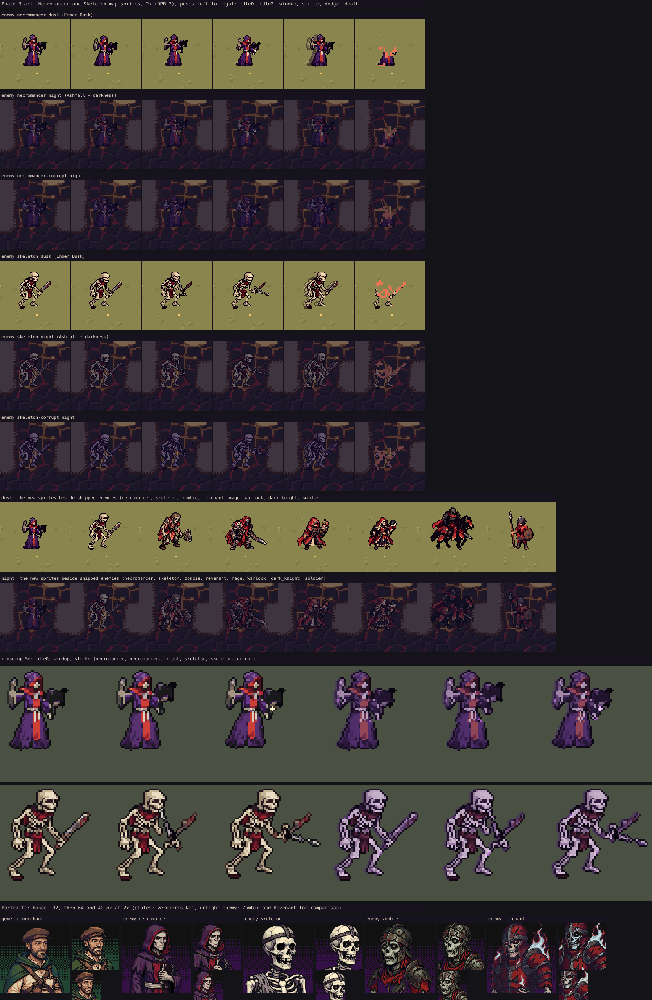

# Phase 3 art batch

Spec: `docs/specs/phase3.md` §3I "Art" (on `claude/phase3-spec`), `docs/specs/event-art.md` items 6.

`phase3-art.webp` (made by `node tools/art/sprite-trace/dev/phase3-sheet.mjs <out.webp>`) shows,
at display size (2x = DPR 3), every pose of the Necromancer and the Skeleton on the dusk and
night grades, plain and corrupted, a night comparison against shipped enemies, a 5x close-up,
and the three portraits at 192 / 64 / 40 px. The grades are an approximation of `AtmosphereFX`
(split-tone, saturation, contrast, exposure; no vignette) plus the night layer's darkness.
Poses: `idle0`, `idle2`, `windup`, `strike` are baked frames; `dodge` (side-step plus
afterimage) and `death` (pixel dissolve) are what `CombatFxController` does to `idle0`, drawn
the same way.

## Assets

| Asset | Key | Made by | Recorded in |
| --- | --- | --- | --- |
| Caravan Merchant portrait | `generic_merchant` (verdigris plate) | `tools/art/portrait-variants/gen-legacy-extra.mjs` → `tools/art/pc98/build.mjs` | `tools/art/portrait-variants/legacy-extra.json` |
| Necromancer portrait | `enemy_necromancer` (unlight plate) | same | same |
| Skeleton portrait | `enemy_skeleton` (unlight plate) | same | same |
| Necromancer, Skeleton class sheets | `docs/art/class-sprite-review-2026-09-22/sheets/{necromancer,skeleton}.png` | `tools/art/sprite-trace/gen-class-sheet.mjs --class <Name>` | `docs/art/class-sprite-review-2026-09-22/catalog.json` |
| Map sprites | `necromancer`, `enemy_necromancer`, `enemy_necromancer-corrupt`, the same for `skeleton` | `ENEMY_ONLY_CLASSES` in `tools/art/sprite-trace/roster.mjs` → `node tools/art/sprite-trace/cli.mjs bake` | roster recipe |

Regenerate: `node tools/art/portrait-variants/gen-legacy-extra.mjs --id <id> --takes 4`, pick
with `--choose <n>`, then `node tools/art/pc98/build.mjs --only <id>`; sheets with
`gen-class-sheet.mjs --class Necromancer --takes 4` and `--choose <n>`, then
`node tools/art/sprite-trace/cli.mjs bake`. Raw takes stay in `References/` (gitignored).

## Decisions

- The Merchant, Necromancer and Skeleton are **single portraits** (no variants), like the Zombie
  and Revenant: one Merchant design, at most one Necromancer per battle, the Skeleton is a
  monster. They are therefore not in `ENEMY_CLASSES` (`tests/PortraitVariants.test.js` asks four
  faces of every listed class).
- The Skeleton reads as bone: skull, ribs and limbs are the `linen` slot (never `skin`, which
  turned the skull peach), only the rags are faction crimson. The Necromancer's violet robe is its
  own cloth (`sub`) and only its crimson lining and tabard are the faction area.
- `enemy_necromancer` and `enemy_skeleton` are in the unlight list of `tools/art/pc98/lib/config.mjs`.
- Regenerated: the Necromancer sheet three times (a first black-violet robe sank into night
  ground, a second brighter pass read as a cheerful priest; the third plum robe with ragged hem
  and a crimson tabard is shipped), and its portrait once to match.
