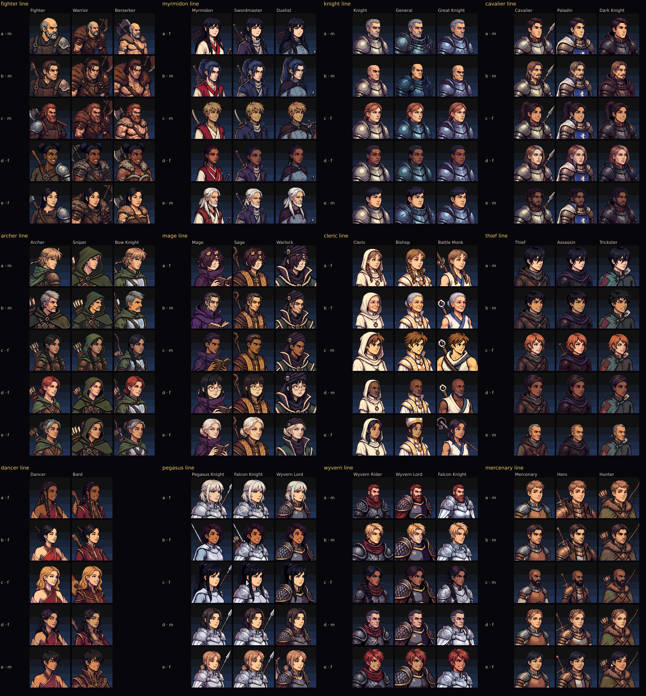
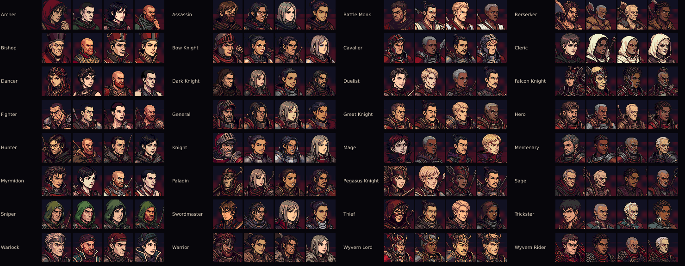
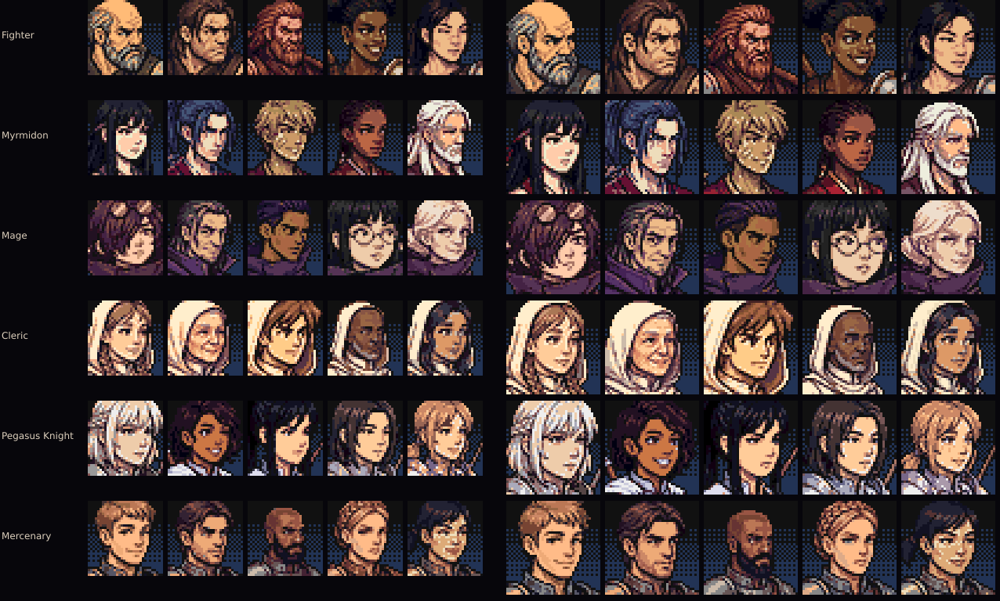

# Portrait variety

Every generic unit now wears one of several faces for its class, kept for its whole run
(spec: [`docs/specs/portrait-variety.md`](../../specs/portrait-variety.md)). Lords and bosses
keep their portraits; map sprites stay shared per class.

| | |
| --- | --- |
| Player side | 12 class lines x 5 people, each drawn in every class of the line: **175 drawings**, 60 people (Falcon Knight and Wyvern Lord: 10 people each through the cross promotions; Bard has its own drawings for the first time) |
| Enemy side | 32 human enemy classes x **4 faces** (128) in the Empire's iron and crimson |
| Redrawn | every legacy 128 px generic and enemy default, at the quality of the four approved rebuilt generics (kept as is) |
| Style | the unchanged PC-98 pass (`tools/art/pc98`): 12-bit colour, ~13 colours + ink, ordered dither, selective ink, faction plate |

## Contact sheets

- `contact-player.webp` — each class line: people (rows) x classes (columns), 96 px on the
  player plate, 1:1. Read across a row to see one person promote.
- `contact-enemy.webp` — each enemy class, its four faces at 64 px on the blood plate.
- `roster-strip.webp` — the faces as the roster shows them: list chips (32 px) and the phone
  summary (40 px), at 3x like a DPR-3 iPhone.
- `roster-844x390.png`, `roster-1280x800.png` — the roster with the playtest pair (Bram and
  Roderick, both Fighters) wearing different faces (from `tests/e2e/portrait-variety*.spec.js`).
- `merc-board-*.png`, `arena-fighters-*.png` — the text lists that now carry the unit's face
  (colosseum merc board: candidates offered together never share a face).

## Pipeline (`tools/art/portrait-variants/`)

1. `catalog.mjs` — who: per line, five people (gender, age, skin, hair, features, expression)
   and which existing portrait anchors them (`keep` the rebuilt art, `remaster` a legacy
   design); per class, the outfit; enemy look library; recruit name genders.
2. `plan.mjs` — expands it into 299 generation jobs and the runtime table
   `src/data/portraitVariants.json` (people, their drawings per class, enemy faces, names).
3. `generate.mjs` — the shared client `tools/art/gen/geminiImage.mjs` (curl through the egress
   proxy; no key in the repo). References: a style sheet of four approved rebuilt portraits;
   the person's first drawing (identity) or the legacy portrait (remaster); the class default
   (outfit only). Jobs wait until their references are current; requests are paced and back
   off on the spend-rate limit and stop on a daily quota. Gemini 3 Pro Image drew 149 of the
   171 generated player portraits; after its daily quota (250 requests/day) the other 22 and
   all 128 enemy faces were drawn with Gemini 3.1 Flash Image from the same references and
   prompts, then held to the same review.
4. `review.mjs` — every raw was looked at and accepted (`review.json`, raw hashes) or retaken
   with a fix note (`notes.json`: 24 retakes, e.g. a legacy General remastered as a tiny floating
   bust, enemy portraits drawn as 2x2 grids, enemy outfits in the player's blue, a woman
   Berserker given a leather chest wrap instead of the bare chest).
5. `prepare.mjs` — cut the figure out of its white backdrop (flood from the top and upper
   sides so a white robe at the bottom edge is never seeded; pure-white pockets; light fringe
   peeled), locate face and eyes with a vision model, and place the figure so the eye line,
   face centre and face size match the approved set (eye 0.36, face ~0.38 of the frame, never a
   gap under the bust); 384 px 256-colour source in `docs/art/portrait-variant-sources/`
   (not shipped) + `sources.json` (framing, grid, raw hash).
6. `tools/art/pc98/build.mjs` — renders every source at 192/96/64/48/40/32; variants are
   figures only (no baked 192, not in the atlases).
7. `sheet.mjs` — these contact sheets. `probe-memory.mjs` — the texture probe below.

Provenance: `docs/art/portrait-variant-sources/generations.jsonl` (every image request the
client made, including rejected takes: prompt, references, model, output) and
`detections.jsonl` (face/eye boxes). PC-98 render provenance: `tools/art/pc98/provenance.json`.

## Runtime

- `src/engine/PortraitVariants.js` chooses and stores `unit.portraitVariant` (stable hash of
  run seed, name and class; never `Math.random`; skips faces the army wears; name-matched
  gender; legacy backfill on load; enemies by spawn identity).
- `portraitIdForUnit` (`src/ui/portraitArt.js`) is the one resolver for every portrait
  surface; canvas keys go through `unitPortraitKey` (`src/ui/RebuiltPortraits.js`).
- `src/ui/portraitTextures.js` loads variant faces for the canvas on demand (figure + plate
  composited at the display size, LRU-capped at 96, released when a battle ends).

## Memory probe

`node tools/art/portrait-variants/probe-memory.mjs` (Chromium, iPhone 13 profile at 844x390,
dev server, `battle_smoke` seed 42; decoded texture bytes = w x h x 4 per texture source,
counted once). Two runs each; "before" is main at ef8027d.

| Scene | Textures before | Textures after | Portrait textures before / after | Variant canvas faces | DOM portraits decoded |
| --- | --- | --- | --- | --- | --- |
| Title | 249.16 MB | 249.16 MB | 11.35 / 11.35 MB | 0 | 0 |
| Route map, roster open | 240.07 MB | 240.07 MB | 8.55 / 8.55 MB | 0 | 22.8 KB (5 faces) both |
| Battle | 240.13-241.60 MB | 240.14-241.61 MB | 8.55 / 8.55 MB | 12.8 KB (two 40 px faces) | 0 |

The battle total moves by ~1.5 MB between runs on both builds (effects timing); portrait
textures are identical. The ~240 new faces add nothing at boot and a few KB per unit on
screen. The shipped PC-98 set is 5.4 MB on disk (was 2.9 MB; provenance no longer ships).

## Budget rules kept

- Every figure ships at the size it is drawn (192/96/64/48/40/32; nothing above 3x its
  display size); 4-bit palette PNGs.
- Boot atlases and baked 192 textures hold the 94 class defaults, exactly as before.
- No raw generations, backups or provenance under `assets/`; sources live in `docs/art/`.
- Guards: `tests/PortraitArtBudget.test.js`, `tests/PortraitVariants.test.js`,
  `tests/Pc98Portraits.test.js`.
