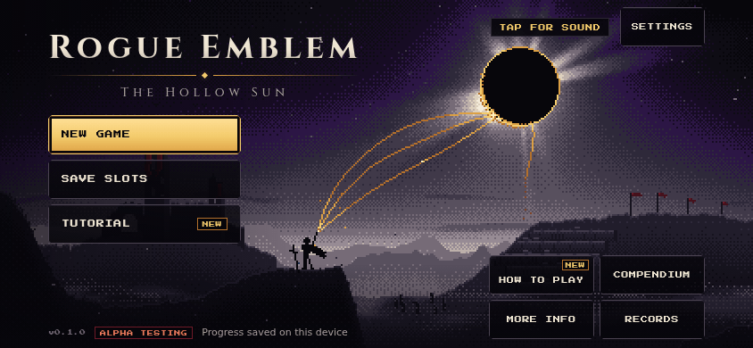
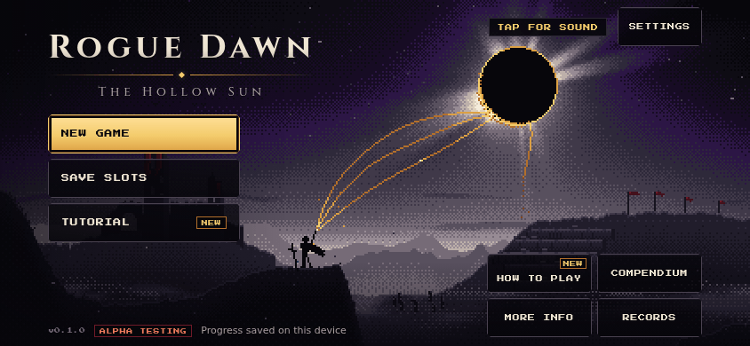
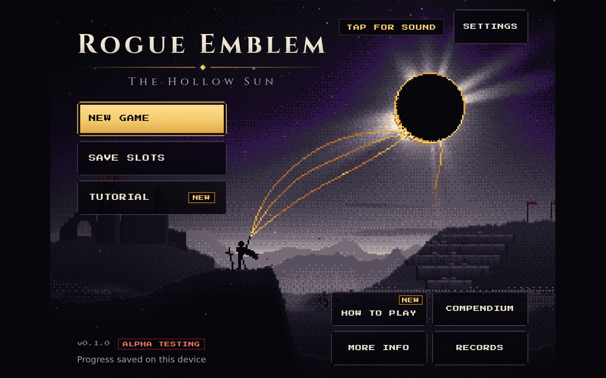
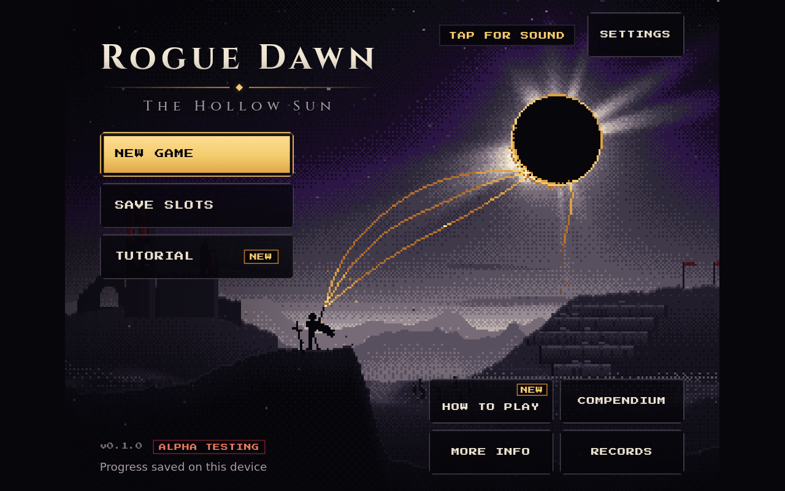

# Rename: Rogue Emblem → Rogue Dawn (2026-09-25)

Title screen before and after the rename, captured from the dev server (`?devScene=title`,
reduced motion, default `dusk` variant, one empty save slot). Design-log entry:
[`../../design-log.md`](../../design-log.md) ("The game is called Rogue Dawn").

| | Before | After |
|---|---|---|
| Phone 844×390 (`mobilePreview=1`) |  |  |
| Desktop 1280×800 |  |  |

Only the Cinzel wordmark changes. "ROGUE DAWN" is two letters shorter, so the lockup narrows
(phone 351 → 301 px, desktop 532 → 456 px) and the menu, corner actions and 44px targets do
not move. The subtitle stays *The Hollow Sun*.

The auth screen's static lockup (`index.html`) uses the same markup and styles, and
`tests/GameIdentity.test.js` holds its text to `GAME_TITLE`.

No shipped raster art carries the name: the app icon (`public/icons/*`,
`tools/icon-src/app-icon-pixel.png`, iOS `AppIcon-512@2x.png`) is a winged sword crest
with no lettering, and the iOS launch image is still Capacitor's stock placeholder.
