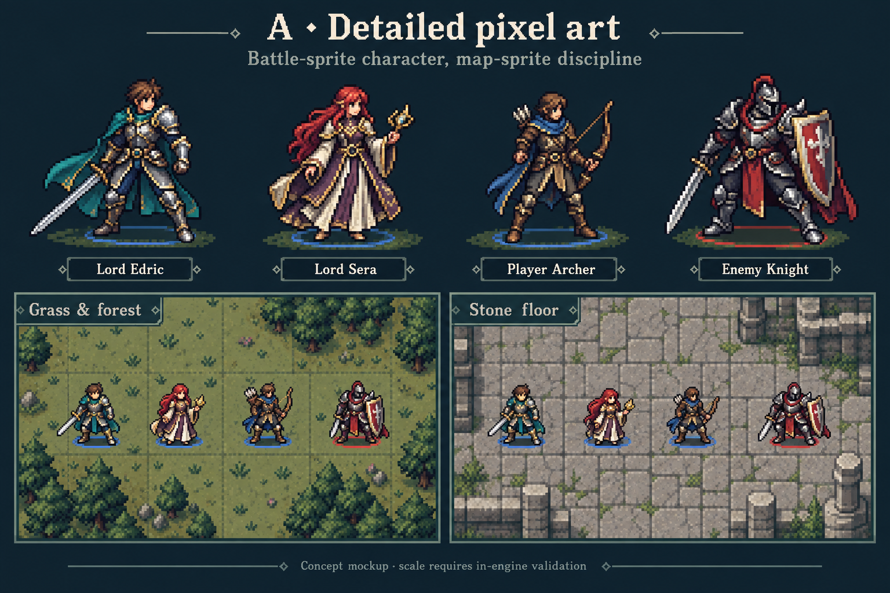

# Battlefield sprite exploration — paused September 21, 2026

## Resume here

**Latest user direction:** the attached **A · Detailed pixel art** board is strong;
try generating sprites like those when returning to this work. This updates the
earlier preference for B's illustrated style. Preserve B as a useful secondary
reference, not the sole approved direction. No style is approved for production.

The desired balance is richer character art than simple GBA map icons, but clean
silhouettes and readable colors on existing maps. Keep individual character
identity instead of making everybody a blue/red uniform. Edric and Sera on the
concept boards are too ornate for starting classes: use those designs as promoted
references. Starting versions need simpler clothing, armor, weapons and staves.

## What was explored

1. **Early simple GBA:** four classes in blue/red, strong team readability but too
   simple to carry the game's desired art direction.
2. **A detailed pixel:** richer battle-sprite craftsmanship with compact map
   silhouettes. Latest leading reference. Its map panels are generated mockups,
   not actual engine captures; their apparent detail is not proof of phone-scale
   readability.
3. **B illustrated:** clean ink/cel-painted sprites. Initially the favorite.
4. **C sculpted:** explored 3D-inspired volume; result remained closer to painted
   sprites than genuinely distinct 3D miniatures. No engine migration proposed.
5. Generated simpler starting Edric/Sera illustrations, then a direct pixel-sprite
   trial, then a directly designed illustrated map-sprite pair. User's idea of
   generating the sprite directly is worth continuing.

## Asset inventory

All images are exploratory, not runtime assets. Originals remain preserved in the
Codex generated-images directory; these durable project copies are authoritative
for resuming. No external Fire Emblem screenshot is used as a shipping asset.

| Path | Meaning |
| --- | --- |
| `concepts/A-detailed-pixel-leading-reference.png` | Latest preferred board; same design as user's final attached reference |
| `concepts/B-illustrated.png` | Earlier preferred illustrated direction |
| `concepts/C-sculpted.png` | 3D-inspired shading study |
| `concepts/early-simple-GBA.png` | Earlier direction judged too simple |
| `sources/illustrated-source.png` | Simplified starting lords, tall illustrative poses |
| `sources/direct-source.png` | Direct pixel-style attempt; too far toward chunky/chibi for B's style |
| `sources/map-source.png` | Direct illustrated map-pose attempt, bolder shapes |
| `validation/comparison.png` | Real terrain/texture comparison: current, illustration, direct illustrated; 32px tiles shown at 2× |
| `validation/game-current.png` | Actual browser game before temporary texture replacement |
| `validation/game-illustrated.png` | Actual game with simplified illustrations fitted to existing anchors |
| `validation/game-direct.png` | Actual game with direct illustrated map sprites |
| `validation/placement.json` | Measured alpha bounds and placement for the final two source pairs |

The final comparison's “Direct” column uses **map-source.png**, not
**direct-source.png**. Both final generated columns use smoothing on reduction;
the shipping current sprites use their existing texture treatment. The older
pixel trial is preserved as a source only, not a separate final comparison.

## What was actually verified

A muted, isolated browser session loaded the development battle fixture and
replaced Edric/Sera textures in memory only. No save migration, runtime art
replacement, production code changes, release, or combat correctness test occurred.
The comparison sheet used real WeatheredTerrain tiles and the game's current
textures and spritePlacement function. Browser and temporary server were stopped.

- Existing 32px tiles and tile-center coordinates retained.
- 64×64 texture canvas, feet at y=44.
- Edric fitted to 34px visible height; Sera to 30px.
- Original illustrated pair fitted to 28px/19px wide; direct illustrated pair to
  29px/25px wide. This width difference helps explain Sera's stronger silhouette.
- Shrinking full illustrations lost clarity. Direct map designs had larger,
  clearer color masses but still did not reproduce the richness suggested by A.
- Generated images have alpha, but clean cutout edges, faint fringe and exact
  source pixel grids have NOT been production-certified. Prompted pixel counts
  were not guaranteed by the generator.
- A itself has NOT been extracted or generated as standalone sprites and tested
  in engine. That is the most useful next experiment.

## Next session: bounded experiment

1. Start from **A**, especially the small figures in its terrain panels. Generate
   standalone transparent sprites directly, not another presentation board.
2. Use two or three samples: simpler base Edric and Sera, plus Archer or Knight.
   Preserve the ornate lord designs for promoted variants.
3. Ask for compact tactical poses, slight overhead angle, purposeful pixel
   clusters, controlled outlines and clear material/color groups. Avoid both tiny
   generic GBA icons and ornate full-size portraits. Try separate one-unit assets
   to avoid half-sheet overlap and padding ambiguity.
4. Keep grid size and gameplay unchanged. Compare at current 30–34px visible
   height first. Consider a modest size or sampling experiment only if necessary;
   distinguish renderer changes from art changes.
5. Check grass, forest and stone, then actual phone layout with HP bars, faction
   rings, acted/dim states, selection and danger overlays. Include original art
   alongside the trial at equal size. No claim that an enlarged concept guarantees
   final readability.
6. Show the small comparison before expanding the roster or shipping anything.

## Generation notes / reusable brief

All concepts used the built-in image-generation tool with existing game sprite
and terrain references, plus the user's classic/modern tactics references for
style only. No CLI/API generation was used.

Reusable next prompt (a recommended new brief, not a verbatim historical log):

> Generate an original standalone transparent tactical map sprite matching the
> detailed pixel craftsmanship of board A's small map figures. Preserve the
> supplied Rogue Emblem character identity. Compact three-quarter tactical pose,
> slightly overhead view, controlled dark outline, deliberate pixel clusters,
> distinct face/hair/clothing color masses, no background, labels, ground shadow
> or faction ring. Intended final visible height 30–34px on a 32px tile. Richer
> than a tiny generic GBA map icon, simpler than a full battle illustration.
> For starting Edric use a simple teal cloak, brown tunic, light silver armor and
> plain sword; for starting Sera use red hair, cream/plum robes and a plain staff.
> No promotion ornamentation. Judge the result after resizing in engine.

## Coordination

Another agent owns `docs/specs/battlefield-rewind-plan-2026-09-21.md` and active
battle/history code changes. This art exploration did not edit those files.
Production remains the existing brightened art with charcoal contours (build 17).
