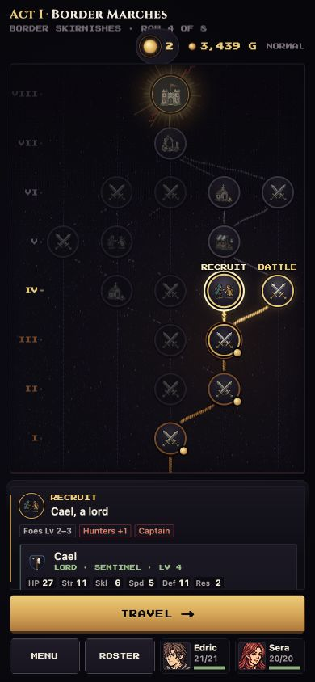
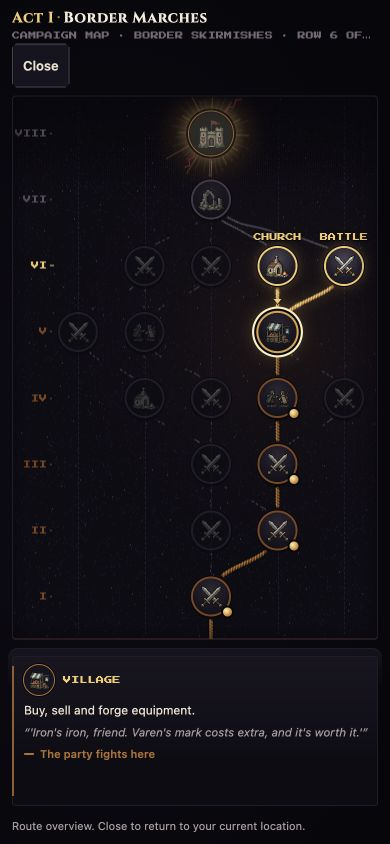
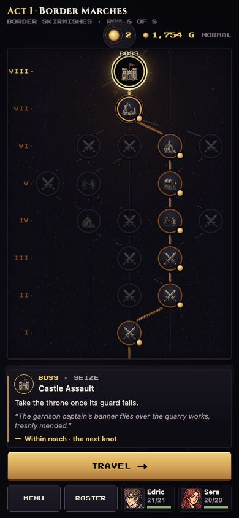

# Portrait playtest continuation — September 26

## Outcome
Three additional Normal battles won (four total), Cael recruited, no casualties, and one unused rewind charge. Reached the Act 1 boss approach after visiting the village, church, and ruins. Saved at Title with Edric level 5 (21/21 HP), Sera level 5 (20/20), Cael level 4 (27/27), 1,754 gold, and 2 shadow. Normal mode has **not** been beaten.

No crash, blocked progression, or lost purchase/reward was observed. This is continued visible gameplay on the same combined portrait stack documented in [the original report](review.md), not a test of newer PR revisions. Same simulated coarse-pointer presentation caveat applies; this was 390×844 desktop-hosted portrait, not physical iPhone testing. No gameplay code changed or new automated test run performed.

## New findings

### P2 — Recruit preview buries the actionable instruction
On the route, select Cael's Recruit node at row 4. The fixed-height detail panel shows title, encounter badges, and the top of the recruit's stat card, but hides “Reach them with a lord and Talk” below the fold. Travel is immediately visible. Scrolling within the panel reveals the instruction, but the default view gives little indication that essential guidance is below it.

The in-battle recruitment hint correctly explains Talk and mitigates this for players receiving hints. Move the short recruitment instruction above the stat block and add an overflow cue; preserve the detailed stats for comparison.

### P3 — Service map uses combat-specific location copy
Village → View map labels the current Village node “Current battle” in accessibility text and says “The party fights here” in its details. There is no battle or ambush in progress. Closing the map correctly returns to the shop. Use service-neutral “You are here” / “The party rests here” unless a battle is actually active.

### Minor clarity — Attack range text is broader than the equipped weapon
Edric carries Iron Sword, Steel Sword and Wind Sword. With Iron Sword equipped, the disabled Attack action says “No target in range 1–2,” although Iron Sword's own range is 1. The action correctly considers carried weapons and offers Wind Sword for a range-2 attack. This is useful behavior; wording such as “No carried weapon can reach” would explain the apparent mismatch.

### Art readability observation — class identity still needs inspection
At this phone scale the enemy Myrmidon initially looked like a mage to the tester; the forecast correctly identified Myrmidon/Iron Sword. Treat this as a subjective silhouette/weapon-readability observation, not a wrong-asset or mechanics defect. Class labels remain important for unfamiliar players.

## Gameplay and balance observations
- Cael's recruitment was immediately useful: 27 HP / 11 DEF let him hold a swordsman dealing zero damage. His axe's low accuracy against a forest Myrmidon (37–44% shown) made that a slow matchup. Strong defense with a clear offensive limitation felt distinct; one encounter does not justify a nerf.
- The Wind Sword reward provided valuable range despite lower attack/speed. Three Vulneraries and Armorslayer were credible alternatives. The fallback gold remains intentionally a fallback.
- A later 700 gold + 25 team XP offer was preferable to +5 Hit whetstone or Armorslayer for this party; the separate 271 fallback gold was strictly inferior in that roll. Consider hiding/de-emphasizing fallback when a gold reward already dominates it, rather than increasing fallback value.
- Took Mend over Master Seal / Goddess Icon for immediate healing flexibility. This is a preference, not proof of a dominant reward. Sera is only level 5, so promotion eligibility was still distant.
- The route produced Village → Church → Ruins before the boss. Church and Ruins both provide free healing and revival, so much of the second service node's value overlapped. The ruins market still offered a useful Shine purchase, but its 25% markup makes the sequence less attractive than distinct services. Consider warning route generation against overlapping service functions, not only identical node types.
- Kindle correctly stated the actual reduction of 2 shadow for 400 gold alongside the maximum of 8; skipped it while the Eclipse was Pale. No copy defect here.
- Village rescue succeeded in one battle and failed in another while regrouping the party. This was a tactical tradeoff. The compact battle header showed only Rout/enemy count in the observed default view; a small persistent village status could keep that secondary objective in mind without revealing enemy AI triggers.

## Verified flows
- Three full battles: village rescue, another village encounter, and Cael's rescue. All three party members survived.
- Normal movement, range-2 attacks using a carried weapon, weapon cycling, cancel/back navigation, healing, consumables, counters, recruitment/Talk, and victory rewards worked.
- Wind Sword reward reached Edric's inventory and survived immediate reload of the autosaved route; gold stayed at 2,218.
- Roster equip switched Edric to Iron Sword; roster Vulnerary restored 11/21 → 21/21 and used one charge.
- Cael could act on the turn he joined; his joining presentation fit portrait.
- Mend reward reached Sera. After reload, Heal showed 4/4 and Mend 3/3, both with refill wording.
- Hand Axe purchase: 4,204 → 3,504 gold; recipient Cael; item removed from stock and persisted in Cael's inventory.
- Steel Sword accuracy forge: 3,504 → 3,254 gold; Hit 85 → 90; name Steel Sword +1; remaining shop forges 2 → 1. Upgrade persisted after reload.
- Leave/re-enter village retained stock and gold. View map/Close returned to the shop.
- Church free healing persisted through reload for all three units. Recruitment, purchased weapon, and forged weapon also persisted.
- Convoy withdrawal transferred the rescued village Vulnerary to Sera and reduced convoy consumables 1 → 0.
- Ruins sanctuary → market → return worked; markup was explicit. Bought Shine for Sera (3,254 → 1,754) with a visible +3 Attack / −2 Attack speed comparison.
- Saved and returned to Title at a living, fully healed boss approach. Sound remained off throughout.

## Remaining coverage
Act 1 boss onward, actual rewind restore, promotion/revival, full-run end and Home Base, desktop comparison on the current stack, and physical touch/Safari acceptance remain. The older separate Act 2 Normal save is untouched. Existing small-phone clipping and contextual-hint findings remain in the original report; this continuation does not claim they were fixed.
