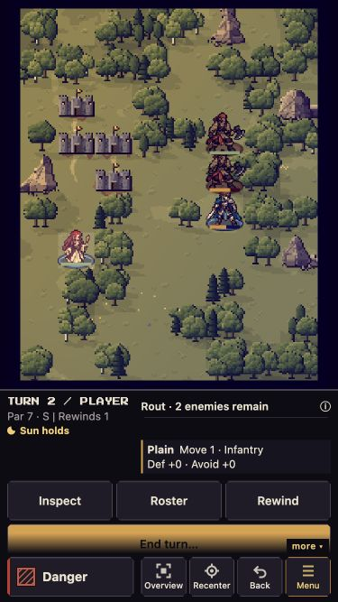
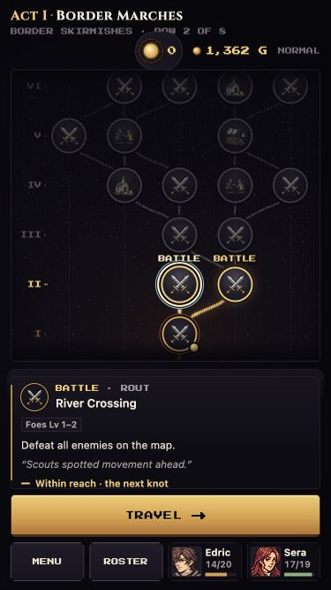

# Combined portrait-stack playtest — 2026-09-26

**Follow-up:** [Three more battles, recruitment, shops, church and ruins](continuation.md).

## Verdict
Promising in this limited desktop-hosted phone-layout pass. No crash or blocked progression was observed through one complete Normal battle, rewards, roster healing, and save/reload. This is not physical iPhone acceptance or a full-run stability sign-off.

## Findings

### P2 — End turn is partially below the fold at 375×667
After terrain information appears in the idle battle rail, the bottom of End turn is clipped by the scrolling region near the “more” cue and fixed utilities. Initial idle presentation without terrain fits; turn 2 with terrain reproduces it. It fits at 390×844. Wait stays pinned and usable.

This confirms the known small-phone rough spot remains in the combined stack. Prefer pinning End turn in idle state, as Wait is pinned in unit action state, or allocating enough command height while retaining terrain information. Do not simply remove terrain bonuses.

Source context: `src/ui/MobileBattleHUD.js`, `pinnedRailCommand` currently pins only Wait; `src/ui/battleRail.css` places the scroll cue over the scroll region.

### P3 — Teaching hint can outlive its unit context
A disabled-Attack hint referring to Edric appeared after the selection had moved to Sera. Its instruction to go Back and choose a closer tile was stale after Edric had already waited. Consider cancelling queued contextual hints when their unit/action state changes. Observed once; not attributed specifically to the portrait PRs.

### Polish — Compendium controls consume substantial vertical space
On 375×667, category/filter controls occupy roughly half the available view, leaving approximately five list entries visible. List/detail navigation works, but a compact category selector would improve browsing. Not blocking.

## Verified through visible gameplay
- Title, Compendium list/detail/Back, and roster stats fit the portrait shell.
- Vertical route selection and pinned Travel action are clear.
- First-run onboarding explains that Home Base choices unlock after the run; the initial bypass is intentional.
- Movement, targeting, weapon comparison, forecast cancellation, staff healing, enemy phase, level-up and victory work in the rotated board.
- Cancelled Steel Sword comparison returned Edric to Iron Sword.
- History Previous action and Previous turn update phase/event labels. Back returns to the live turn without spending the rewind charge. No actual restore was exercised in this pass.
- Landscape 844×390 and portrait 390×844 transitions preserve the live battle and show the appropriate board orientation.
- First battle won on turn 3, Rank S, both lords alive.
- Rewards remain portrait at 375×667. View map → Return to rewards preserves the unclaimed options and blocks further travel until selection.
- Gold choice changed 772 to 1,362 (+590), and the route returned to Travel. Only one claim was made.
- Post-battle Heal staff reads 3/3, “Refills after battle.”
- Roster Vulnerary use changes Sera 7/19 → 17/19 HP and uses 3 → 2.
- Save & Return to Title → reload → Resume preserves 1,362 gold, Edric 14/20 and Sera 17/19.

## Exact scope and limitations
Local integration commit `7689a2c8840cd73707b561f03ee6debe8d87f47a`, based on main `b8e13bf`, combines the following reviewed heads without manual conflict resolution:

| PR | Head |
|---|---|
| #99 | 87839a490cd11893f146377d8be593d22359335b |
| #122 | 76a1aa21e14b63834d344f07024b4482e4607884 |
| #124 | b9d9b4ec541bd0e9884fe3cb8c94073b83ab5fee |
| #125 | f935c193282d53f387f2693ea57e3b629f0433ed |
| #126 | 03cfccd9eaf6cba49872378190d10f90ebc81e21 |
| #128 | 5832a585d3b5c04786dc8eddb84de5f8451f560d |
| #129 | 9307e3b85494ff617e81d54caf14f33855c44fd8 |

Production build passed. 93 focused tests passed across BoardOrientation, PortraitBattle, PortraitListLayout, LoomModel and LoomThreads. This was not the full test suite.

Browser: Codex in-app browser, isolated localhost:3099 save origin; music and SFX muted. Existing playtest saves were preserved. Viewports: 375×667, 390×844, 844×390.

**Emulation caveat:** the browser viewport capability changes dimensions but does not emulate a coarse pointer. A temporary, untracked Vite presentation adapter forced the coarse-pointer gate for mobilePreview, omitted the landscape-only mobile-preview CSS class, and substituted coarse-pointer CSS media checks. No gameplay rules or saves were edited. Build/tests ran before this adapter. This validates layout/flow under simulated phone presentation, not real Safari pointer detection, touch/pinch behavior, safe areas, or OS rotation. Pre-adapter letterboxing was excluded from findings.

Not reached: Home Base after run completion, shops/churches, promotion, long inventory lists, actual rewind restore, and late-game maps. These remain targeted follow-ups, along with physical iPhone portrait/landscape checks. No product source fixes or remote integration-branch publication were performed.
