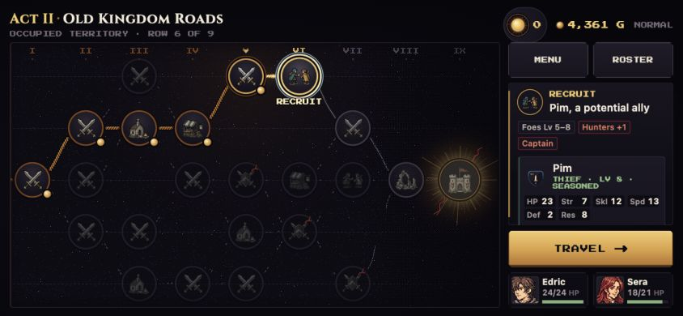

# Rogue Dawn — mobile/desktop playtest and code review

September 26, 2026. Read-only application review of main through PR #113, commit `336cd41d98611a755485a8641fcc95cd83b36428`. Isolated checkout `/tmp/rogue-review113`. This report does not cover merges after that snapshot or PR #99's portrait branch. No application changes, commits, or deployment.

## Outcome and coverage

- Mobile landscape: 844×390, isolated origin `http://127.0.0.1:3092/?mobilePreview=1`. Tutorial plus **nine Normal battles won**, including Act I boss and an elite escape. Four units alive, Act II next node recruit Pim. **Normal has not been beaten.** No deliberate losses, state injection, hidden-state tactical assistance, or RNG retries.
- Mobile systems exercised: recruit Talk, actual rewind, suspend/reload, ordinary route reload, weapon comparisons, weapon art, item trade and immediate use, roster equipment, shops/restock/forge limits, church healing, scroll binding, reward recipients, gold fallback, multi-reward elite, class mastery, deeds, fog, escape and seize.
- Desktop: 1308×735, isolated origin3093. Two battles won; third battle turn3 with Maud recruited and all three alive. Desktop execution stopped when automatic approval review rejected an ordinary combat-preview click and then a read-only screenshot. The tool returned no explanation; no workaround attempted.
- No mobile crash or softlock observed. Real rewind restored the selected earlier action and consumed exactly one charge; revised tactics kept the party alive. Save/reload and reward delivery worked on the sampled paths.
- Final mobile checkpoint: nine wins, four living units, 4,361G, Act II completed row5/next row6. Save→Title→reload→slot1 restored route, gold and visible lord HP. Returned to Title, kept muted settings, reset temporary viewport. Run is ready to continue; there is no full-run verdict.
- Physical iPhone, native app lifecycle, portrait, audio quality (muted), Acts III/IV and finale remain untested. Browser emulation is not physical iOS acceptance.

## Priority findings

### P2 — Legacy duplicate-name recruit checkpoint can lose the correct casualty

**Engine-reproduced, upgrade edge.** A pre-UID midbattle save can contain a hired mercenary and Talk recruit with the same name. If the hire dies and recruit survives, current fallback pairing can put the surviving recruit in both living and fallen rosters, losing the actual casualty's identity/items. Current fully stamped saves and new name exclusion work correctly.

Preserve/migrate battle entity identity before serialization rather than matching the legacy survivor to the roster by name. Relevant code: `src/engine/BattleRecruits.js:104–110`, `UnitIdentity.js:84–91`, `RunManager.js:3430–3458`. Exact seed/object reproduction and evidence in [code review](code-review.md). Not an end-to-end browser upgrade test. This is the most consequential confirmed correctness finding.

### P2 — Desktop rewind exists but its shortcut can disappear

**Visible + source-confirmed.** At1308×735 the footer hides the intended R hint while retaining D/O/E and context cancel; the top-left resource says “Eye” without teaching invocation. R is bound (`BattleScene.js:1170`); `DesktopBattleHud.js:258` drops the hint when the single row runs out of room. This is discoverability, not missing functionality.

Keep an explicit rewind/vision command with R badge, or wrap secondary shortcuts. User's proposal to reuse the newer mobile presentation on desktop is well supported by this audit: share command/item/forecast data and action handlers, then provide a responsive desktop dock, focus support and keyboard badges. Do not turn on touch camera/input globally just to obtain the panel.

### P2 — Desktop hover HP can remain stale after combat

**Repeated visible observation; source cause unconfirmed.** Pointer left over an attacked target retains its pre-hit HP, including a dead Fighter at6/22, until the pointer moves. Refresh or dismiss hover details when combat resolves. See [desktop notes](desktop.md).

### P2 — Desktop item action omits information present on mobile

Desktop battle Item lists `Vulnerary (3)` without healing amount or action cost before immediate use. Mobile explicitly says restore10HP and uses do not refill. Unify content and add the action-cost explanation. This is a concrete maintenance cost of separate UI implementations.

### P2 — Phone forecast prioritizes weapon navigation over important numbers

At844×390, the weapon carousel and labels push the player's Hit/Crit below the initial view while the enemy side can already show those values. Scroll controls work, but essential comparisons require extra scrolling. Keep damage×hits, Hit and counter information visible together; put secondary detail below. Normal attack HP projection was useful and accurate in sampled fights. Art forecasts omit that projected HP/KO line, which is a consistency opportunity rather than a demonstrated arithmetic error.

### P3 — Named route portrait opens the wrong unit

Tap Sera's route chip → full roster opens Edric. Every chip calls zero-argument `_openRoster`; overlay starts atindex0. Pass the selected unit through. Anchors: `NodeMapMenu.js:224–225`, `NodeMapScene.js:1443`, `RosterOverlay.js:131/179`. Existing behavior, not new in this merge batch.

### P3 — “The Last” awarded with everybody alive

Leona received lore “Came back alone, carrying the names of the rest” after a casualty-free four-unit victory. Engine probe reproduces three living lords plus one living nonlord. The written rule/tests deliberately count the sole surviving nonlord against total deployment; implementation follows that rule. Change the design condition or narrative together, and add a no-loss negative case. `DeedSystem.js:573–587`, `data/deeds.json:241–247`. Details in [code review](code-review.md).

### P3 — One-stat level gains can say “Nothing gained”

Observed +1RES/+1SPD/+1HP with zero-gain wording. Total gains0or1 share the blank/lean voice pool (`growthContent.js:223–228`, `UnitVoice.js:208–214`). Separate zero from one or use wording valid for both. Stats actually increased.

### P3 — Native repeated-deletion watermark edge

**In-memory backend probe only.** A previously tombstoned slot, followed by a new run written and removed before the next native flush, can retain the first deletion timestamp. A later WebKit rollback retaining the newer run could resurrect it. Equality compares only null values and skips the advanced watermark (`nativeSaveMirror.js:512`). Original deletion bug is fixed; this narrower debounce/crash sequence remains. See [save review](save-ui-review.md); no physical-device reproduction, not evidence of routine save loss.

## UI polish and explanations

- **Healing:** battle action asks for a highlighted map target but does not show current→healedHP target rows. Also says Cancel while the available utility is Back. A concise target list matching Attack would help.
- **Forecast traits:** Shieldmate/Resolve appear as plain names; no in-context tooltip/long-press handler. Full explanations exist in roster. Add an explicit detail affordance; do not imply existing long press works.
- **Service reentry:** leaving Church or Ruins leaves completed currentnode with disabledTravel; village explicitly offers Re-enter shop. Observed contrast; decide the intended contract. Current route implementation only adds `canReenterShop` nodes to availability (`NodeMapMenu.js:117,279–309`).
- **Terrain:** swamp/bog penalties are readable after tapping, but their art boundaries are subtle at phone scale. Stronger tile differentiation would reduce exploratory taps without reducing difficulty.
- **Enemy classes:** small silhouettes repeatedly required target-label inspection to distinguish archers, clerics, mages and sword infantry. Subjective readability concern, not a verified wrong-asset mapping. The final Mire Crossing cleric did advance with the army; no stationary-cleric bug reproduced.
- **Encounter language:** “six at the ford, mostly quarry picks” preceded two sword Myrmidons. Derive tactical claims or avoid concrete counts/weapon promises. “Hunters+1,” “Captain,” and “Prof” need nearby explanations.
- **Shop:** Sol Scroll header's RequiresProf is ambiguous for a skill-teaching item; confirm intended restriction/copy. Not yet source-verified.
- **Binding:** consecutive confirmations and PageUp/Down/controller instructions on phone add friction.
- **Desktop:** active pale-green Confirm Attack looks disabled; improve contrast.
- **Tutorial:** casualty screen has large unused space and death/revival wording needs its tutorial exception clarified. Generic move-adjacent advice is a poor fit for Sera's ranged attack.
- **Transient terrain fallback:** legacy tiles briefly appeared on resume before painterly art loaded. Same asynchronous painter runs on fresh/resume; no persistent missing-art defect confirmed.

## Balance observations — limited sample

- Leona's initial lone Steel Lance produced AS0 and a dangerous mage double. Weight forges750G raised AS to2; available village stock offered no light lance fallback. Consider a lighter starter option or clearer draft equipment/AS preview. This single roll/loadout does not establish a global recruit-stat issue.
- Iron vs Steel speed tradeoffs, ranged counter avoidance and armor/magic matchups materially changed decisions. Preserve those choices.
- Hunter's Volley was worthwhile when ordinary bow damage left a Thief at1HP:16×2 at100%,8HP upfront, correct result. The cost was intelligible.
- Took814G fallback over duplicate BarrierRing, reclass seal and weight upgrade to fund future promotion; this fulfilled its intended backup role. No recommendation to force equal value.
- One genuine formation error required rewind. Enemy-phase pressure was punishing but recoverable through formation, trade+use and healing. Do not infer Normal difficulty from a single surviving run.
- Promotion/late-game balance and permanent-upgrade economy remain outside this run's current coverage.

## Verification

- 340 tests across11 recruit/identity/loot/sprite/continuation suites passed.
- 124 tests across7 native-save/ceremony/slot/forecast suites passed.
- Additional14 battlefield-art and47 deed tests passed; the deed probe exposes an untested design edge despite the suite passing.
- 1,504 generated recruit placements across Acts I–IV: zero impassable spawn tiles for the actual recruit movement type. This checks placement, not rescue difficulty.
- Production build passed. These are focused checks, not a claim that the entire repository/browser suite is green.

## Next test and implementation tracks

1. Continue saved Normal attempt from Act II/Pim. Do not claim completion yet.
2. Add a desktop shared-panel exploration: preserve mouse/keyboard strengths, visible rewind shortcut, always-available terrain/objective, shared item/forecast detail; avoid a wholesale mobile-input switch.
3. PR99 portrait: separate preview at375×667 plus a taller phone. Check Cancel/Endturn below More cue, selected-unit/map visibility, forecast scrolling, safe area, keyboard dismissal, zoom/pan and orientation transitions. Browser results inform iteration; real phone comfort/performance is still user acceptance. No current verdict on keep/iterate/drop.
4. Test-only mutation coverage: loot delivered to inventory, double-gold claims, exact capacity boundaries, crit/weight rounding, save-validator edge cases. Each must fail against its corresponding planted fault and pass clean baseline. User's proposal to delegate is sensible; not started in this read-only playtest.
5. Forecast-purity migration: first pin existing behavior with tests. Verify PR114 integration status before touching shared command rail; defer implementation until ownership/dependency resolves. Explicit gameplay RNG follows after that settles.

## Evidence

[Mobile chronological notes](mobile-notes.md) · [Desktop report](desktop.md) · [Recruit/code review](code-review.md) · [Save/UI review](save-ui-review.md)

